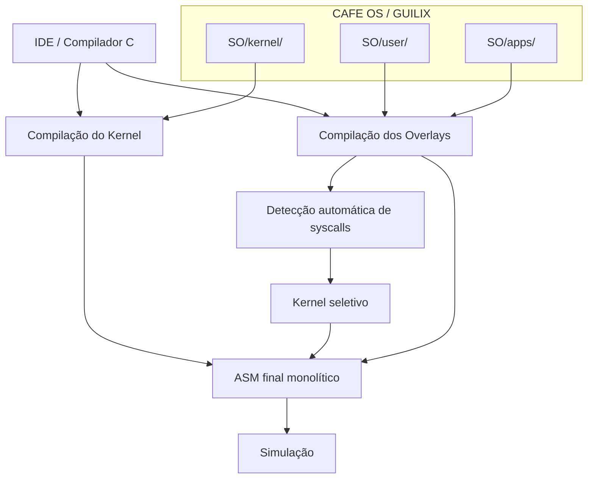

<div align="center">

# ☕ CAFE OS / GUILIX

### *Configurable And Flexible Environment Operating System*

**Um sistema operacional acadêmico, modular e extensível para estudos de kernel, compiladores, escalonamento, syscalls, IPC e aplicações de usuário em overlay.**

<br>


</div>

---

## ✨ Visão geral

O **CAFE OS**, codinome **GUILIX**, é um sistema operacional acadêmico desenvolvido para experimentação com conceitos fundamentais de sistemas operacionais e compiladores.

O projeto foi reorganizado para adotar o modelo:

> **Kernel fixo + aplicações de usuário em overlay**

Nesse modelo, o kernel evolui de forma independente das aplicações. Cada aplicação de usuário é um arquivo C próprio, localizado em `SO/apps/`, contendo uma função `main()`. A IDE/Compilador se encarrega de compilar o kernel, compilar os overlays selecionados, injetá-los no ASM final e gerar um sistema monolítico pronto para simulação.

---

## 🎯 Objetivos do projeto

O CAFE OS / GUILIX foi pensado como um ambiente didático para estudar, implementar e testar:

| Área | O que o projeto permite explorar |
|---|---|
| **Kernel** | boot, dispatcher, syscalls, processos e serviços internos |
| **Processos** | PCB, estados, escalonamento e troca de contexto lógica |
| **Memória** | heap dinâmico, alocação, liberação e desfragmentação |
| **IPC** | pipes, memória compartilhada e mensageria simples |
| **Sincronização** | semáforo, mutex/spinlock e yield cooperativo |
| **Sinais** | `signal()`, `sigreturn()`, `pause()`, `alarm()` e `kill()` |
| **Threads** | criação experimental de fluxos que compartilham memória |
| **Compilador** | geração de ASM, otimização e kernel seletivo |
| **Userland** | aplicações independentes em formato overlay |

---

## 🧠 Arquitetura conceitual



A IDE é o centro do fluxo de build. O desenvolvedor não precisa editar manualmente o kernel para adicionar novas aplicações: basta criar um arquivo em `SO/apps/` e selecioná-lo no modo **Kernel+Overlay**.

---

## 🚀 Principais recursos implementados

### 🧩 Kernel modular

O kernel foi dividido em módulos menores, facilitando evolução, testes e inclusão seletiva no ASM final.

Principais módulos:

```text
SO/kernel/
├── sys_main.c
├── sys_core.h
├── sys_mem.c
├── sys_sched_rr.c
├── sys_overlay.c
├── sys_proc_exit.c
├── sys_proc_wait.c
├── sys_proc_kill.c
├── sys_proc_sleep.c
├── sys_proc_spawn.c
├── sys_wakeup.c
├── sys_sem.c
├── sys_mutex.c
├── sys_pipe.c
├── sys_shm.c
├── sys_msg.c
├── sys_thread.c
└── sys_io.c
```

### 🔁 Escalonamento Round-Robin

O escalonador principal percorre a tabela de processos e seleciona o próximo processo em estado `READY`.

Estados suportados:

| Estado | Significado |
|---|---|
| `READY` | Processo pronto para executar |
| `RUNNING` | Processo em execução |
| `BLOCKED` | Bloqueado por sincronização |
| `TERMINATED` | Finalizado |
| `WAITING` | Aguardando outro processo |
| `SLEEPING` | Dormindo por número de ticks |
| `PAUSED` | Pausado até receber sinal |
| `WAITING_PIPE_READ` | Aguardando leitura em pipe |
| `WAITING_PIPE_WRITE` | Aguardando escrita em pipe |

### 🧠 Gerenciamento de processos

O sistema utiliza uma tabela de **PCBs** (*Process Control Blocks*), onde cada processo possui estado, contexto, prioridade, dados de espera, sinais pendentes e informações relacionadas à execução em overlay.

Chamadas principais:

```c
exit();
wait(pid);
kill(pid, signal);
yield();
spawn(...);
```

### 🧮 Heap dinâmico

O kernel possui um heap com política **First-Fit** e suporte a coalescência de blocos livres.

Funções principais:

```c
malloc(size);
free(ptr);
kernel_defrag();
```

### 🔒 Sincronização

O sistema implementa sincronização por:

- semáforo com bloqueio no kernel;
- mutex/spinlock;
- `yield()` cooperativo em esperas ocupadas.

Chamadas de usuário:

```c
sem_lock();
sem_unlock();
mutex_lock();
mutex_unlock();
```

### 📡 IPC: comunicação entre processos

Recursos disponíveis:

| Recurso | Descrição |
|---|---|
| **Pipes** | Buffer circular com bloqueio de leitura/escrita |
| **Memória compartilhada** | Blocos identificados por chave via `shmget()` |
| **Mensagens** | Envio e recepção simples de valores entre processos |

### 🚦 Sinais

Sinais básicos inspirados no modelo POSIX:

| Sinal | Uso |
|---|---|
| `SIGKILL` | Finalização forçada |
| `SIGTERM` | Pedido de encerramento |
| `SIGALRM` | Gerado por `alarm()` |
| `SIGCONT` | Continuação de processo pausado |

Chamadas relacionadas:

```c
signal(handler);
sigreturn();
get_signal();
pause();
alarm(ticks);
```

### 🧵 Threads experimentais

O suporte a `thread_create()` permite criar fluxos de execução que compartilham o domínio de memória do processo pai.

> ⚠️ **Atenção:** esse recurso é experimental. Use semáforos ao compartilhar dados e evite funções não reentrantes em threads concorrentes.

---

## 📁 Nova estrutura do projeto

```text
CAFE_OS/
├── IDE_CompiladorC/
│   ├── IDE_GCC.py
│   ├── build_modes.py
│   ├── codegen.py
│   ├── parser.py
│   ├── semantic.py
│   ├── optimizer.py
│   ├── preprocess.py
│   ├── lexer.py
│   ├── formatter.py
│   └── gera_IDE.sh
│
└── SO/
    ├── KERNEL.c
    │
    ├── kernel/
    │   ├── sys_main.c
    │   ├── sys_core.h
    │   ├── sys_mem.c
    │   ├── sys_sched_rr.c
    │   ├── sys_overlay.c
    │   ├── sys_proc_exit.c
    │   ├── sys_proc_wait.c
    │   ├── sys_proc_kill.c
    │   ├── sys_proc_sleep.c
    │   ├── sys_proc_spawn.c
    │   ├── sys_wakeup.c
    │   ├── sys_sem.c
    │   ├── sys_mutex.c
    │   ├── sys_pipe.c
    │   ├── sys_shm.c
    │   ├── sys_msg.c
    │   ├── sys_thread.c
    │   └── sys_io.c
    │
    ├── user/
    │   ├── usr_exit.c
    │   ├── usr_yield.c
    │   ├── usr_sleep.c
    │   ├── usr_print_char.c
    │   ├── usr_read_char.c
    │   ├── usr_printstr.c
    │   ├── usr_printint.c
    │   ├── usr_sync.c
    │   ├── usr_pipe.c
    │   ├── usr_shm.c
    │   ├── usr_msg.c
    │   ├── usr_signal.c
    │   ├── usr_thread.c
    │   └── usr_syscalls.c
    │
    ├── apps/
    │   ├── app_hello.c
    │   ├── app_counter.c
    │   ├── _template_minimal.c
    │   └── _template_stdio.c
    │
    ├── legacy/
    ├── docs/
    └── build/
```

---

## 🧭 Fluxo de compilação na IDE

A IDE/Compilador possui quatro modos principais.

| Modo | Uso recomendado |
|---|---|
| **Full** | Compilar um arquivo C como programa completo tradicional |
| **Kernel** | Compilar somente `SO/KERNEL.c` |
| **Overlay** | Compilar somente uma aplicação em `SO/apps/` |
| **Kernel+Overlay** | Compilar kernel e injetar uma ou mais aplicações de usuário |

### 🧱 Compilar o kernel

```text
1. Abrir SO/KERNEL.c
2. Clicar em Kernel
3. Verificar o ASM gerado
```

### 📦 Compilar um overlay isolado

```text
1. Abrir um arquivo em SO/apps/
2. Clicar em Overlay
3. Verificar se o overlay compila corretamente
```

### 🚀 Compilar kernel com overlays

```text
1. Abrir SO/KERNEL.c
2. Clicar em Kernel+Overlay
3. Selecionar um ou mais arquivos em SO/apps/
4. A IDE gera o ASM final monolítico
```

> ✅ Não é necessário editar includes manualmente nem executar scripts auxiliares. A IDE cria as configurações virtuais necessárias durante a compilação.

---

## ⚙️ Kernel seletivo

No modo **Kernel+Overlay**, a IDE analisa os overlays selecionados e detecta quais syscalls são usadas.

Com isso, o kernel final inclui apenas os módulos necessários.

| Se o overlay usa... | O kernel inclui... |
|---|---|
| `printstr()` / `print_char()` | Suporte de saída |
| `exit()` | Finalização de processo |
| `sleep()` | Temporização e estado `SLEEPING` |
| `sem_lock()` / `mutex_lock()` | Sincronização |
| `write_pipe()` / `read_pipe()` | Pipes |
| `shmget()` | Memória compartilhada |
| `signal()` / `pause()` / `alarm()` | Sinais |
| `thread_create()` | Threads experimentais |

Essa estratégia reduz o tamanho do ASM final e mantém o kernel mais fácil de evoluir.

---

## 📚 Bibliotecas de usuário

Para reduzir o tamanho dos overlays, inclua apenas as bibliotecas necessárias.

| Biblioteca | Funções |
|---|---|
| `usr_exit.c` | `exit()` |
| `usr_yield.c` | `yield()` |
| `usr_sleep.c` | `sleep()` |
| `usr_print_char.c` | `print_char()` |
| `usr_read_char.c` | `read_char()` |
| `usr_printstr.c` | `printstr()` |
| `usr_printint.c` | `printint()` |
| `usr_sync.c` | `sem_lock()`, `sem_unlock()`, `mutex_lock()`, `mutex_unlock()` |
| `usr_pipe.c` | `write_pipe()`, `read_pipe()` |
| `usr_shm.c` | `shmget()` |
| `usr_msg.c` | `msg_send()`, `msg_recv()` |
| `usr_signal.c` | `signal()`, `sigreturn()`, `get_signal()` |
| `usr_thread.c` | `thread_create()` |
| `usr_syscalls.c` | Agregador de compatibilidade |

> 💡 Use `usr_syscalls.c` apenas para compatibilidade com código antigo. Para overlays novos, prefira bibliotecas pequenas e específicas.

---

## 🛠️ Criando uma nova aplicação de usuário

Copie um template:

```bash
cp SO/apps/_template_minimal.c SO/apps/minha_app.c
```

ou:

```bash
cp SO/apps/_template_stdio.c SO/apps/minha_app.c
```

Depois edite apenas a função `main()`.

### Exemplo mínimo

```c
#include "../user/usr_exit.c"

void main() {
    exit();
}
```

### Exemplo com saída de texto

```c
#include "../user/usr_printstr.c"
#include "../user/usr_exit.c"

void main() {
    printstr("Minha aplicação\n");
    exit();
}
```

### Exemplo com laço cooperativo

```c
#include "../user/usr_printstr.c"
#include "../user/usr_yield.c"

void main() {
    while (1) {
        printstr("rodando\n");
        yield();
    }
}
```

---

## 🧪 Tarefas antigas convertidas para overlays

O modelo antigo usava funções como:

```c
naked void task_a() { ... }
naked void task_b() { ... }
```

Na estrutura atual, cada tarefa foi convertida para uma aplicação independente com `main()`.

Exemplo:

```text
usr_tasks_1.c
```

foi convertido para:

```text
legado_01_counter_a.c
legado_01_counter_b.c
```

Para testes que dependem de PID fixo, selecione os overlays na ordem indicada pela documentação do pacote convertido.

```text
primeiro overlay selecionado -> PID 0
segundo overlay selecionado  -> PID 1
```

Isso é importante para testes com `wait(1)`, `kill(0, ...)`, sinais, pipes e IPC.

---

## 📞 Tabela de syscalls

| ID | Função | Descrição |
|---:|---|---|
| 1 | `exit` | Encerra o processo atual |
| 2 | `wait` | Aguarda o término de um PID específico |
| 3 | `kill` | Envia sinal para um processo |
| 4 | `sem_lock` | Bloqueia acesso via semáforo de kernel |
| 5 | `sem_unlock` | Libera acesso via semáforo de kernel |
| 6 | `spawn` | Cria novo processo dinamicamente |
| 7 | `mutex_try` | Tenta obter mutex |
| 8 | `mutex_unlock` | Libera mutex |
| 9 | `yield` | Cede voluntariamente a CPU |
| 10 | `print_char` | Saída de caractere |
| 11 | `read_char` | Entrada de caractere |
| 12 | `sleep` | Suspende o processo por N ticks |
| 13 | `alarm` | Agenda `SIGALRM` para o processo |
| 14 | `pause` | Suspende processo até receber sinal |
| 15 | `signal` | Registra handler de sinal |
| 16 | `sigreturn` | Retorna do contexto de sinal |
| 17 | `get_signal` | Obtém o sinal pendente atual |
| 20 | `write_pipe` | Escreve dado no pipe |
| 21 | `read_pipe` | Lê dado do pipe |
| 25 | `shmget` | Aloca ou obtém memória compartilhada |
| 27 | `msg_send` | Envia mensagem simples |
| 28 | `msg_recv` | Recebe mensagem simples |
| 29 | `thread_create` | Cria thread compartilhando memória do processo pai |

---

## ✅ Boas práticas para overlays

- Use sempre `void main()` como ponto de entrada.
- Evite `naked` em aplicações comuns.
- Inclua apenas as bibliotecas userland necessárias.
- Chame `exit()` quando a aplicação terminar.
- Em laços infinitos, use `yield()` quando possível.
- Para testes com múltiplos processos, selecione os overlays na ordem correta.
- Evite depender de funções internas do kernel em aplicações de usuário.
- Prefira bibliotecas pequenas, como `usr_printstr.c` e `usr_exit.c`, em vez do agregador `usr_syscalls.c`.

---

## 🧱 Boas práticas para evoluir o kernel

- Mantenha `SO/KERNEL.c` pequeno.
- Não inclua aplicações em `SO/KERNEL.c`.
- Coloque novas funcionalidades em módulos próprios dentro de `SO/kernel/`.
- Crie bibliotecas correspondentes em `SO/user/` quando a funcionalidade precisar ser chamada por overlays.
- Atualize o fluxo seletivo da IDE para detectar a nova funcionalidade.
- Teste primeiro o kernel isolado, depois `Kernel+Overlay` com uma aplicação simples.

Exemplo de evolução recomendada:

```text
1. Criar SO/kernel/sys_nova_funcionalidade.c
2. Criar SO/user/usr_nova_funcionalidade.c
3. Ensinar a IDE a detectar a nova syscall ou biblioteca
4. Criar SO/apps/app_teste_nova_funcionalidade.c
5. Testar em modo Overlay
6. Testar em modo Kernel+Overlay
```

---

## 🖥️ Gerando o executável da IDE

Para gerar um executável único da IDE/Compilador:

```bash
cd IDE_CompiladorC
chmod +x gera_IDE.sh
./gera_IDE.sh pyinstaller
```

ou:

```bash
cd IDE_CompiladorC
chmod +x gera_IDE.sh
./gera_IDE.sh nuitka
```

Os arquivos gerados ficam em:

```text
IDE_CompiladorC/dist/
```

---

## 🧭 Fluxo recomendado de trabalho

### Evoluir o kernel

```text
1. Alterar arquivos em SO/kernel/
2. Abrir SO/KERNEL.c na IDE
3. Compilar em modo Kernel
4. Testar
5. Compilar em modo Kernel+Overlay com uma aplicação simples
```

### Criar uma aplicação

```text
1. Criar arquivo em SO/apps/
2. Incluir apenas as bibliotecas necessárias de SO/user/
3. Implementar void main()
4. Compilar em modo Overlay
5. Testar com Kernel+Overlay
```

### Testar múltiplas aplicações

```text
1. Abrir SO/KERNEL.c
2. Clicar Kernel+Overlay
3. Selecionar os overlays desejados na ordem correta
4. Gerar e executar o ASM final
```

---

## 🧾 Resumo executivo

O **CAFE OS / GUILIX** é um sistema operacional acadêmico modular que separa claramente:

```text
SO/kernel/ -> implementação do kernel
SO/user/   -> bibliotecas de usuário
SO/apps/   -> aplicações em overlay
```

A IDE/Compilador coordena todo o processo de build. O desenvolvedor não precisa editar o kernel para adicionar novas aplicações. Basta criar um overlay em `SO/apps/`, selecionar no modo **Kernel+Overlay** e gerar o sistema final.

<div align="center">

---

### ☕ CAFE OS / GUILIX

**Um laboratório vivo para aprender, testar e evoluir sistemas operacionais, compiladores e aplicações em espaço de usuário.**

</div>
