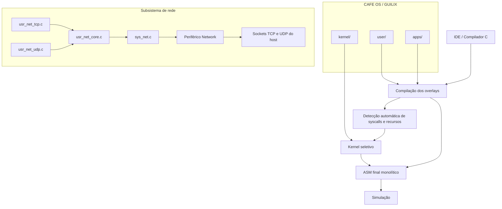
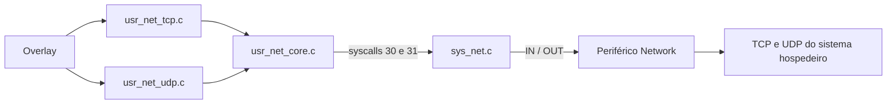

<div align="center">

# ☕ CAFE OS / GUILIX

### *Configurable And Flexible Environment Operating System*

**Um sistema operacional acadêmico, modular e extensível para estudos de kernel, compiladores, processos, escalonamento, memória, IPC, threads, redes TCP/UDP e aplicações de usuário em overlay.**

<br>


</div>

---

## ✨ Visão geral

O **CAFE OS**, codinome **GUILIX**, é um sistema operacional acadêmico desenvolvido para experimentação integrada com conceitos fundamentais de sistemas operacionais, compiladores e programação de aplicações em espaço de usuário.

O projeto adota o modelo:

> **Kernel modular + aplicações de usuário em overlay + build seletivo conduzido pela IDE**

Cada aplicação é mantida em um arquivo C próprio dentro de `apps/`, com uma função `main()`. Quando o repositório é incorporado ao ambiente maior do CompSim, essa pasta pode aparecer como `SO/apps/`.

A IDE/Compilador:

1. compila os overlays selecionados;
2. detecta automaticamente as syscalls e os subsistemas necessários;
3. monta um kernel seletivo;
4. injeta as imagens compactas dos overlays;
5. verifica os limites dos segmentos;
6. bloqueia builds que excedem a arquitetura;
7. gera o ASM final monolítico para simulação.

A arquitetura permite evoluir o kernel e as aplicações de forma independente, mantendo o sistema dentro do perfil de **4096 palavras de instruções** e **4096 palavras no segmento de dados**.

<p align="center">
  
</p>

<p align="center"><em>Demonstração: compilação, inicialização do kernel e execução de aplicações de usuário.</em></p>

---

## 🎯 Objetivos do projeto

O CAFE OS / GUILIX foi concebido como um laboratório didático para estudar, implementar e testar:

| Área | O que o projeto permite explorar |
|---|---|
| **Kernel** | boot, dispatcher, syscalls, serviços internos e tratamento de eventos |
| **Processos** | PCB, estados, criação, término, espera e troca de contexto |
| **Escalonamento** | Round-Robin, Prioridade Fixa e Prioridade Dinâmica com Aging |
| **Memória** | heap dinâmico, alocação, liberação, coalescência e propriedade de recursos |
| **IPC** | pipes, memória compartilhada e mensageria simples |
| **Sincronização** | semáforos, mutexes e espera cooperativa |
| **Sinais** | registro de handlers, entrega, retorno, pausa e alarmes |
| **Threads** | criação, compartilhamento de dados, pilha própria, espera e `thread_exit()` |
| **Redes** | cliente/servidor TCP e comunicação UDP/IPv4 orientada a datagramas |
| **Compilador/IDE** | geração de ASM, otimizações, kernel seletivo e análise de segmentos |
| **Userland** | bibliotecas pequenas e aplicações independentes em overlay |

---

## 🧠 Arquitetura conceitual



A IDE é o centro do fluxo de build. O desenvolvedor não precisa editar manualmente o kernel para adicionar uma aplicação: basta criar um arquivo em `apps/` e selecioná-lo no modo **Kernel+Overlay**.

<p align="center">
  
</p>

---

# 🚀 Recursos implementados

## 🧩 Kernel modular

O kernel é dividido em módulos menores para facilitar manutenção, testes e inclusão seletiva.

```text
kernel/
├── sys_main.c
├── sys_core.h
├── sys_config.inc
├── sys_init.inc
├── sys_dispatch.inc
├── sys_kernel_includes.inc
├── sys_tick.inc
├── sys_signal_inject.inc
├── sys_mem.c
├── sys_sched_rr.c
├── sys_sched_fp.c
├── sys_sched_dp.c
├── sys_overlay.c
├── sys_overlay_shared.c
├── sys_proc.c
├── sys_proc_exit.c
├── sys_proc_wait.c
├── sys_proc_kill.c
├── sys_proc_sleep.c
├── sys_proc_spawn.c
├── sys_proc_resources.c
├── sys_wakeup.c
├── sys_sem.c
├── sys_mutex.c
├── sys_pipe.c
├── sys_shm.c
├── sys_msg.c
├── sys_signal.c
├── sys_thread.c
├── sys_thread_exit.c
├── sys_io.c
└── sys_net.c
```

No modo **Kernel+Overlay**, apenas os módulos necessários são incluídos no build final.

A inicialização dos overlays possui duas variantes internas:

- `sys_overlay.c`: versão enxuta para aplicações sem criação dinâmica;
- `sys_overlay_shared.c`: versão integrada a `spawn`, `thread_create` e `thread_exit`, com reutilização da infraestrutura de processos.

---

## 🔁 Escalonamento configurável

O CAFE OS / GUILIX mantém uma interface única, `schedule()`, cuja implementação pode ser substituída por diferentes políticas.

| Arquivo | Política | Ideia central | Uso didático |
|---|---|---|---|
| `sys_sched_rr.c` | **Round-Robin** | percorre circularmente os processos `READY` | justiça simples e depuração |
| `sys_sched_fp.c` | **Prioridade Fixa** | seleciona o maior valor de `priority` | prioridade e starvation |
| `sys_sched_dp.c` | **Prioridade Dinâmica com Aging** | usa `priority + age` | mitigação de starvation |

### 🌀 Round-Robin

É a política recomendada para testes gerais:

- alterna circularmente entre os processos prontos;
- distribui a CPU de forma previsível;
- combina bem com `yield()`, `sleep()`, sinais, IPC, threads e rede;
- usa *time warp* quando não há processo pronto, avançando `system_ticks` para acordar tarefas dormindo ou disparar alarmes.

### 🏁 Prioridade Fixa

Seleciona sempre o processo `READY` com maior prioridade base:

- favorece tarefas consideradas críticas;
- permite observar starvation de tarefas menos prioritárias;
- mantém o processamento de `sleep()` e alarmes durante períodos ociosos.

### 🌱 Prioridade Dinâmica com Aging

A prioridade efetiva é calculada por:

```text
effective_priority = priority + age
```

Processos prontos que continuam aguardando acumulam `age`. Quando um processo é escolhido, seu envelhecimento volta para zero.

### ⚙️ Seleção do escalonador

Mantenha somente uma implementação ativa em `kernel/sys_main.c`:

```c
#include "kernel/sys_sched_rr.c"

// Alternativas:
// #include "kernel/sys_sched_fp.c"
// #include "kernel/sys_sched_dp.c"
```

A troca do escalonador não exige alteração nos overlays.

### Estados de processo

| Estado | Significado | Impacto no escalonamento |
|---|---|---|
| `READY` | pronto para executar | candidato à CPU |
| `RUNNING` | em execução | volta a `READY` ao ser despromovido |
| `BLOCKED` | bloqueado por sincronização | ignorado até ser acordado |
| `TERMINATED` | finalizado | removido da seleção |
| `WAITING` | aguardando outro PID/TID | acorda quando o alvo termina |
| `SLEEPING` | suspenso por ticks | acorda em `wakeup_tick` |
| `PAUSED` | suspenso aguardando sinal | acorda por sinal apropriado |
| `WAITING_PIPE_READ` | aguardando dados no pipe | acorda quando houver dados |
| `WAITING_PIPE_WRITE` | aguardando espaço no pipe | acorda quando houver espaço |

---

## 🧬 Gerenciamento de processos

O sistema utiliza uma tabela de **PCBs** (*Process Control Blocks*). Cada PCB armazena, entre outros elementos:

- estado e contexto de execução;
- prioridade e aging;
- base e tamanho do domínio de dados;
- pilha efetivamente alocada;
- indicação de processo ou thread;
- informações de espera;
- temporização;
- sinais pendentes;
- propriedade e compartilhamento de recursos.

Chamadas principais:

```c
exit();
wait(pid);
kill(pid, signal);
yield();
spawn(...);
```

`spawn()` cria um processo com domínio de dados privado. O filho recebe PCB, pilha e cópia própria dos dados do processo chamador.

<p align="center">
  
</p>

A liberação de recursos é centralizada: `exit`, `kill` e `thread_exit` usam a mesma infraestrutura para liberar pilhas, áreas de dados privadas e demais recursos associados, respeitando domínios compartilhados.

Documentos relacionados:

- `docs/SPAWN_CLONE_DATA.md`;
- `docs/CORRECAO_KERNEL_RELEASE_PROCESS_RESOURCES.md`;
- `docs/PERFIL_3_TAREFAS_DESEMPENHO.md`.

---

## 🧠 Gerenciamento de memória

O kernel possui heap dinâmico com política **First-Fit**, divisão de blocos e coalescência de áreas livres.

```c
malloc(size);
free(ptr);
kernel_defrag();
```

O heap é utilizado por:

- pilhas de overlays;
- processos criados por `spawn`;
- pilhas de threads;
- memória compartilhada;
- estruturas internas dos serviços do kernel.

<p align="center">
  
</p>

---

## 🔒 Sincronização

O sistema oferece:

- semáforo gerenciado pelo kernel;
- mutex/spinlock;
- `yield()` cooperativo em esperas ocupadas.

```c
sem_lock();
sem_unlock();
mutex_lock();
mutex_unlock();
```

A sincronização é especialmente importante para:

- mensagens concorrentes no vídeo;
- dados compartilhados entre threads;
- regiões críticas de IPC;
- cliente e servidor de rede executando simultaneamente.

---

## 📡 Comunicação entre processos

| Recurso | Descrição |
|---|---|
| **Pipes** | buffer circular com bloqueio de leitura e escrita |
| **Memória compartilhada** | blocos identificados por chave através de `shmget()` |
| **Mensageria** | envio e recepção de valores entre processos |

---

## 🚦 Sinais

Sinais básicos inspirados no modelo POSIX:

| Sinal | Uso |
|---|---|
| `SIGKILL` | finalização forçada |
| `SIGTERM` | solicitação de encerramento |
| `SIGALRM` | gerado por `alarm()` |
| `SIGCONT` | continuação de processo pausado |

Chamadas relacionadas:

```c
signal(handler);
sigreturn();
get_signal();
pause();
alarm(ticks);
```

---

## 🧵 Threads experimentais

`thread_create()` cria um fluxo de execução que:

- compartilha o domínio de dados do processo pai;
- possui PC, registradores e estado próprios;
- recebe uma pilha própria;
- participa do mesmo escalonamento dos processos;
- pode ser aguardado com `wait(tid)`.

```c
int tid;
int entry;

asm("MOV rotina_da_thread");
asm("STA entry");

tid = thread_create(entry, 4);
wait(tid);
```

<p align="center">
  
</p>

<p align="center">
  
</p>

### Encerramento explícito com `thread_exit()`

A syscall `thread_exit()` encerra somente a thread chamadora:

```c
void rotina_da_thread() {
    printstr("thread executando\n");
    thread_exit();

    /* Não deve ser alcançado. */
    printstr("erro\n");
}
```

Comportamento:

- valida que o chamador é uma thread;
- marca seu PCB como `TERMINATED`;
- libera a pilha e os recursos exclusivos;
- preserva o domínio de dados ainda usado pelo processo pai ou por outras threads;
- acorda processos bloqueados em `wait(tid)`;
- solicita novo escalonamento.

Se `thread_exit()` for chamado por um processo comum, o kernel retorna erro e não encerra o processo.

A implementação está em:

```text
user/usr_thread.c
kernel/sys_thread_exit.c
docs/THREAD_EXIT.md
apps/legado_18_thread_exit.c
```

> ⚠️ Threads são experimentais. Proteja dados compartilhados com semáforos ou mutexes e evite rotinas não reentrantes em execuções concorrentes.

---

# 🌐 Suporte a redes TCP e UDP/IPv4

O CAFE OS / GUILIX oferece suporte experimental a:

- cliente e servidor TCP/IPv4;
- servidor TCP sequencial em loop;
- sockets UDP/IPv4;
- `bind`, `sendto` e `recvfrom`;
- preservação das fronteiras dos datagramas;
- acesso ao IP e à porta do remetente;
- isolamento dos registradores de controle por PID.



A pilha TCP/IP permanece no sistema hospedeiro. Para a aplicação Guilix, a rede é acessada por uma API própria, mediada pelo kernel e pelo periférico Network.

## 🧱 Componentes

| Camada | Arquivo | Responsabilidade |
|---|---|---|
| Userland comum | `user/usr_net_core.c` | ABI, registradores, status, erros e FIFOs |
| Userland TCP | `user/usr_net_tcp.c` | cliente, servidor, conexão, escuta e aceitação |
| Userland UDP | `user/usr_net_udp.c` | socket, bind, envio e recepção de datagramas |
| Compatibilidade | `user/usr_net.c` | inclui a API TCP para aplicações antigas |
| Kernel | `kernel/sys_net.c` | validação, seleção de contexto e acesso ao periférico |
| Periférico | `devices/network/network.py` | sockets TCP/UDP não bloqueantes, filas, estados e datagramas |
| Descritor | `devices/network/network.csd` | registro das portas do dispositivo no simulador |

Aplicações TCP devem preferir:

```c
#include "../user/usr_net_tcp.c"
```

Aplicações UDP devem preferir:

```c
#include "../user/usr_net_udp.c"
```

Essa divisão evita incorporar código TCP em overlays exclusivamente UDP e vice-versa.

## 🔐 Isolamento de rede por processo

Operações de rede são compostas por vários acessos ao periférico. Como o escalonador pode trocar de processo entre duas syscalls, dois overlays poderiam interferir no socket ou endpoint um do outro.

A solução utiliza a porta privada:

```text
63 — CONTEXT/PID
```

Antes de cada `IN` ou `OUT`, `sys_net.c` informa o PID atual ao dispositivo. O periférico mantém um banco virtual de registradores por processo, incluindo:

- socket selecionado;
- IPv4 remoto ou local;
- porta;
- backlog;
- resultado;
- erro;
- último comando;
- estado `WOULD_BLOCK`.

Os sockets, FIFOs e datagramas são reais, mas cada processo enxerga seu próprio contexto de controle.

> A porta 63 é de uso exclusivo do kernel e não deve ser acessada diretamente pelos overlays.

## 🔌 Portas do periférico

| Porta | Registro | Função |
|---:|---|---|
| 40 | `COMMAND` | executa comandos de rede |
| 41 | `STATUS` | informa estado e flags |
| 42 | `SOCKET` | seleciona socket |
| 43–44 | `RESULT` | resultado de 16 bits |
| 45–46 | `ERROR` | código de erro de 16 bits |
| 47–50 | `IP0..IP3` | endereço IPv4 configurado ou remetente UDP |
| 51–52 | `PORT` | porta em dois bytes |
| 53 | `TX_DATA` | escrita na FIFO de transmissão |
| 54–55 | `TX_COUNT` | bytes pendentes em transmissão |
| 56 | `RX_DATA` | leitura da FIFO de recepção |
| 57–58 | `RX_COUNT` | bytes disponíveis para leitura |
| 59 | `VERSION` | versão do periférico |
| 60 | `MAX_SOCKETS` | número máximo de sockets |
| 61 | `BACKLOG` | tamanho da fila TCP |
| 62 | `SOCKET_STATE` | estado detalhado do socket |
| **63** | **CONTEXT/PID** | **seleção privada de contexto pelo kernel** |

## 🎛️ Comandos do periférico

| Comando | Operação |
|---:|---|
| 1 | reset do periférico |
| 2 | criar socket TCP |
| 3 | iniciar conexão TCP |
| 4 | enviar FIFO TX por TCP |
| 5 | atualizar/poll |
| 6 | fechar socket |
| 7 | limpar FIFO TX |
| 8 | limpar FIFO RX |
| 9 | TCP bind |
| 10 | TCP listen |
| 11 | TCP accept |
| 12 | criar socket UDP |
| 13 | UDP bind |
| 14 | UDP sendto |
| 15 | UDP recvfrom |

## 📞 Syscalls de rede

A interface pública usa somente duas syscalls genéricas:

| ID | Nome | Descrição |
|---:|---|---|
| 30 | `net_out` | escrita validada nas portas lógicas 40–62 |
| 31 | `net_in` | leitura validada nas portas lógicas 40–62 |

A diferenciação entre TCP e UDP ocorre no userland e no periférico, mantendo o dispatcher e o driver do kernel compactos.

---

## 🔗 API TCP

### Cliente TCP

Principais funções:

```c
net_socket_tcp();
net_connect_ipv4(...);
net_wait_connected_socket(...);
net_send_text_socket(...);
net_wait_rx_socket(...);
net_recv_byte();
net_close_socket(...);
```

Exemplo:

```c
#include "../user/usr_net_tcp.c"
#include "../user/usr_exit.c"

int socket_id;
int connected;

void main() {
    socket_id = net_socket_tcp();

    if (socket_id >= 0) {
        /* 192.168.1.50:8081; low=145, high=31. */
        net_connect_ipv4(
            socket_id,
            192, 168, 1, 50,
            145, 31
        );

        connected = net_wait_connected_socket(socket_id, 600);

        if (connected == 1) {
            net_send_text_socket(socket_id, "OLA DO GUILIX\n");
            net_close_socket(socket_id);
        }
    }

    exit();
}
```

### Servidor TCP

Principais funções:

```c
net_socket_tcp();
net_bind_ipv4(...);
net_listen_socket(...);
net_accept(...);
net_wait_accept(...);
net_wait_rx_socket(...);
net_recv_byte();
net_send_byte(...);
net_send();
net_close_socket(...);
```

Exemplo de servidor acessível pela rede local:

```c
server_socket = net_socket_tcp();

/* 0.0.0.0:8081 */
net_bind_ipv4(
    server_socket,
    0, 0, 0, 0,
    145, 31
);

net_listen_socket(server_socket, 2);
client_socket = net_wait_accept(server_socket, 1000);
```

O arquivo `apps/app_net_server_loop.c` mantém o listener aberto e atende clientes sequencialmente sem encerrar o socket servidor após cada conexão.

---

## 📦 API UDP

Principais funções:

```c
net_udp_socket();
net_udp_bind_ipv4(...);
net_udp_sendto_ipv4(...);
net_udp_recvfrom(...);
net_udp_wait_datagram(...);

net_udp_sender_ip0();
net_udp_sender_ip1();
net_udp_sender_ip2();
net_udp_sender_ip3();
net_udp_sender_port_low();
net_udp_sender_port_high();

net_recv_byte();
net_send_byte();
net_udp_close(...);
```

### Semântica dos datagramas

Diferentemente do TCP, UDP preserva a fronteira de cada mensagem. Ao retirar um datagrama com `net_udp_recvfrom()`:

- o tamanho é retornado pela função;
- os bytes são colocados na FIFO RX;
- `IP0..IP3` passam a informar o remetente;
- `PORT` passa a informar a porta do remetente;
- o próximo datagrama permanece separado.

### Exemplo: servidor UDP de eco

```c
#include "../user/usr_net_udp.c"
#include "../user/usr_yield.c"

int socket_id;
int size;
int c;
int i;

void main() {
    socket_id = net_udp_socket();

    /* 0.0.0.0:8082; low=146, high=31. */
    net_udp_bind_ipv4(
        socket_id,
        0, 0, 0, 0,
        146, 31
    );

    while (1) {
        size = net_udp_recvfrom(socket_id);

        if (size < 0) {
            yield();
        } else {
            i = 0;
            while (i < size) {
                c = net_recv_byte();
                net_send_byte(c);
                i = i + 1;
            }

            net_udp_sendto_ipv4(
                socket_id,
                net_udp_sender_ip0(),
                net_udp_sender_ip1(),
                net_udp_sender_ip2(),
                net_udp_sender_ip3(),
                net_udp_sender_port_low(),
                net_udp_sender_port_high()
            );
        }
    }
}
```

> Em código real, salve IP e porta do remetente em variáveis antes de configurar o destino do eco, como feito em `apps/app_net_udp_server.c`.

### Teste UDP pelo Linux

Com `apps/app_net_udp_server.c` executando no simulador:

```bash
printf 'teste\n' | nc -4 -u -w 2 127.0.0.1 8082
```

Verifique o socket:

```bash
ss -lun | grep ':8082'
```

Resultado esperado:

```text
UNCONN ... 0.0.0.0:8082 ...
```

---

## 🌍 Configuração de IP e porta

A porta é dividida em dois bytes:

```text
port_low  = porta % 256
port_high = porta / 256
```

| Porta | `port_low` | `port_high` |
|---:|---:|---:|
| 80 | 80 | 0 |
| 8080 | 144 | 31 |
| 8081 | 145 | 31 |
| 8082 | 146 | 31 |
| 10000 | 16 | 39 |
| 12345 | 57 | 48 |

| Cenário | Configuração |
|---|---|
| Cliente e servidor na mesma máquina | `127.0.0.1` |
| Servidor acessível pela rede local | bind em `0.0.0.0` |
| Simulador cliente → servidor externo | cliente usa o IP do servidor |
| Cliente externo → simulador servidor | cliente usa o IP do computador |
| Servidor UDP | normalmente bind em `0.0.0.0` |
| Cliente UDP | cada `sendto` informa IP e porta do destino |

Em conexões externas, verifique firewall, roteamento e isolamento de clientes na rede.

---

## 🧪 Aplicações de rede incluídas

| Arquivo | Finalidade |
|---|---|
| `apps/app_net_client.c` | cliente TCP pareado em `127.0.0.1:8081` |
| `apps/app_net_server.c` | servidor TCP de eco |
| `apps/app_net_server_loop.c` | servidor TCP sequencial em loop |
| `apps/app_net_client_host.c` | cliente TCP para servidor do host |
| `apps/app_net_echo.c` | exemplo adicional de eco TCP |
| `apps/app_net_udp_client.c` | cliente UDP em `127.0.0.1:8082` |
| `apps/app_net_udp_server.c` | servidor UDP de eco em `0.0.0.0:8082` |
| `apps/_template_network_client.c` | modelo TCP cliente |
| `apps/_template_network_server.c` | modelo TCP servidor |
| `apps/_template_network_udp.c` | modelo UDP |
| `apps/_template_network.c` | modelo de compatibilidade |

---

# 🗂️ Estrutura do projeto

```text
cafe_os/
├── README.md
├── KERNEL.c
├── project.manifest
├── cafe_os_dce_report.txt
│
├── kernel/
│   ├── sys_main.c
│   ├── sys_core.h
│   ├── sys_dispatch.inc
│   ├── sys_mem.c
│   ├── sys_sched_rr.c
│   ├── sys_sched_fp.c
│   ├── sys_sched_dp.c
│   ├── sys_overlay.c
│   ├── sys_overlay_shared.c
│   ├── sys_proc_*.c
│   ├── sys_thread.c
│   ├── sys_thread_exit.c
│   ├── sys_signal.c
│   ├── sys_pipe.c
│   ├── sys_shm.c
│   ├── sys_msg.c
│   ├── sys_io.c
│   └── sys_net.c
│
├── user/
│   ├── usr_runtime.c
│   ├── usr_proc.c
│   ├── usr_exit.c
│   ├── usr_yield.c
│   ├── usr_sleep.c
│   ├── usr_io.c
│   ├── usr_print_char.c
│   ├── usr_read_char.c
│   ├── usr_printstr.c
│   ├── usr_printint.c
│   ├── usr_sync.c
│   ├── usr_pipe.c
│   ├── usr_shm.c
│   ├── usr_msg.c
│   ├── usr_signal.c
│   ├── usr_thread.c
│   ├── usr_net_core.c
│   ├── usr_net_tcp.c
│   ├── usr_net_udp.c
│   ├── usr_net.c
│   └── usr_syscalls.c
│
├── apps/
│   ├── app_hello.c
│   ├── app_counter.c
│   ├── app_net_client.c
│   ├── app_net_server.c
│   ├── app_net_server_loop.c
│   ├── app_net_udp_client.c
│   ├── app_net_udp_server.c
│   ├── legado_01_*.c ... legado_19_*.c
│   ├── legado_18_thread_exit.c
│   ├── README_APLICACOES.md
│   └── _template_*.c
│
├── docs/
│   ├── THREAD_EXIT.md
│   ├── SPAWN_CLONE_DATA.md
│   ├── CORRECAO_KERNEL_RELEASE_PROCESS_RESOURCES.md
│   ├── PERFIL_3_TAREFAS_DESEMPENHO.md
│   ├── legacy/
│   └── img/
│       ├── cafe_os_demo_long.gif
│       ├── arquitetura_build.svg
│       ├── mapa_memoria.svg
│       ├── processo_spawn.svg
│       ├── thread_create.svg
│       ├── spawn_vs_thread.svg
│       └── syscall_desempenho.svg
│
├── legacy/
├── tools/
└── build/
```

O periférico e a IDE normalmente ficam no projeto maior do CompSim:

```text
devices/network/
IDE_CompiladorC/
```

---

# 🧭 Fluxo de compilação na IDE

| Modo | Uso recomendado |
|---|---|
| **Full** | compilar um programa C tradicional |
| **Kernel** | inspecionar o kernel completo |
| **Overlay** | validar uma aplicação isoladamente |
| **Kernel+Overlay** | gerar a imagem executável com kernel seletivo |

## Build recomendado

```text
1. Abrir KERNEL.c
2. Selecionar Kernel+Overlay
3. Escolher um ou mais arquivos de apps/
4. Conferir o relatório de código e dados
5. Executar o ASM final no simulador
```

> O modo executável recomendado é **Kernel+Overlay**. O kernel completo preserva todos os módulos para inspeção, mas pode ultrapassar o limite de instruções.

---

# ⚙️ Kernel seletivo

A IDE analisa os overlays e inclui somente os módulos necessários.

| Se o overlay usa... | O kernel inclui... |
|---|---|
| `printstr()` / `print_char()` | saída de caracteres |
| `read_char()` | entrada de teclado |
| `exit()` | término de processos |
| `sleep()` | temporização e estado `SLEEPING` |
| `sem_lock()` / `mutex_lock()` | sincronização |
| `write_pipe()` / `read_pipe()` | pipes |
| `shmget()` | memória compartilhada |
| `msg_send()` / `msg_recv()` | mensageria |
| `signal()` / `pause()` / `alarm()` | sinais |
| `spawn()` | criação dinâmica e cópia de dados |
| `thread_create()` | criação de threads e domínio compartilhado |
| `thread_exit()` | encerramento específico de threads |
| API de `usr_net_tcp.c` | rede TCP e syscalls 30/31 |
| API de `usr_net_udp.c` | rede UDP e syscalls 30/31 |
| TCP + UDP | núcleo comum de rede carregado uma única vez |

A IDE também:

- mede palavras de instrução;
- mede dados globais, BSS e pilha;
- contabiliza imagens compactas dos overlays;
- detecta símbolos/rótulos ASM duplicados;
- informa a margem restante;
- alerta quando a margem é pequena;
- bloqueia segmentos acima de 4096 palavras.

---

# 📏 Limites de 4K e medições da versão atual

O projeto utiliza dois limites independentes:

| Segmento | Limite | Inclui |
|---|---:|---|
| **Instruções** | 4096 palavras | código do kernel selecionado |
| **Dados** | 4096 palavras | dados, BSS, pilha e imagens compactas dos overlays |

> As instruções dos overlays são armazenadas inicialmente como imagens no segmento de dados do kernel. Por isso, múltiplos overlays grandes pressionam principalmente o segmento de dados.

## Builds validados

| Cenário | Código | Margem de código | Dados + pilha + overlays | Margem de dados |
|---|---:|---:|---:|---:|
| `app_hello` | 2924 | 1172 | 1013 | 3083 |
| `thread_exit` | 3577 | 519 | 1207 | 2889 |
| Shell legado | 2942 | 1154 | 3664 | 432 |
| TCP cliente | 3259 | 837 | 2392 | 1704 |
| TCP servidor | 3259 | 837 | 2401 | 1695 |
| TCP cliente + servidor | 3267 | 829 | 3911 | 185 |
| UDP cliente | 3071 | 1025 | 2072 | 2024 |
| UDP servidor | 3071 | 1025 | 2289 | 1807 |
| UDP cliente + servidor | 3079 | 1017 | 3482 | 614 |
| TCP cliente + UDP cliente | 3267 | 829 | 3585 | 511 |

Validação global da versão:

```text
30/30 aplicações legadas compiladas como overlay
27/27 cenários Kernel+Overlay aprovados
0 falhas
```

O modo Kernel isolado completo permanece destinado à inspeção:

```text
Código:       5659 / 4096
Dados+pilha: 2543 / 4096
```

Para execução no perfil arquitetural, use **Kernel+Overlay seletivo**.

## Memória física recomendada

O sistema utiliza:

- até 4096 palavras para código;
- segmento de dados iniciado em 4096;
- até 4096 palavras para dados, pilhas e imagens.

Portanto, a memória física recomendada é de **8192 palavras**.

---

# 📚 Bibliotecas de usuário

Inclua somente os módulos necessários para reduzir o tamanho do overlay.

| Biblioteca | Funções principais |
|---|---|
| `usr_runtime.c` | valor de retorno comum das syscalls |
| `usr_proc.c` | `exit`, `wait`, `kill`, `spawn` e operações de processo |
| `usr_exit.c` | compatibilidade para `exit()` |
| `usr_yield.c` | `yield()` |
| `usr_sleep.c` | `sleep()` |
| `usr_io.c` | entrada e saída agregadas |
| `usr_print_char.c` | `print_char()` |
| `usr_read_char.c` | `read_char()` |
| `usr_printstr.c` | `printstr()` |
| `usr_printint.c` | `printint()` |
| `usr_sync.c` | semáforos e mutexes |
| `usr_pipe.c` | pipes |
| `usr_shm.c` | memória compartilhada |
| `usr_msg.c` | mensageria |
| `usr_signal.c` | sinais |
| `usr_thread.c` | `thread_create()` e `thread_exit()` |
| `usr_net_core.c` | núcleo comum TCP/UDP |
| `usr_net_tcp.c` | cliente e servidor TCP |
| `usr_net_udp.c` | sockets e datagramas UDP |
| `usr_net.c` | compatibilidade TCP antiga |
| `usr_syscalls.c` | agregador de compatibilidade |

> Para overlays novos, prefira módulos pequenos e específicos. Use `usr_syscalls.c` apenas quando a compatibilidade com código legado for necessária.

---

# 🛠️ Criando uma aplicação

## Exemplo mínimo

```c
#include "../user/usr_exit.c"

void main() {
    exit();
}
```

## Exemplo cooperativo

```c
#include "../user/usr_printstr.c"
#include "../user/usr_yield.c"

void main() {
    while (1) {
        printstr("rodando\n");
        yield();
    }
}
```

## Modelos de rede

```text
apps/_template_network_client.c
apps/_template_network_server.c
apps/_template_network_udp.c
```

---

# 🧪 Aplicações legadas

O modelo antigo utilizava múltiplas tarefas no mesmo arquivo. Na estrutura atual, cada tarefa é uma aplicação independente com `main()`.

```text
usr_tasks_1.c
├── legado_01_counter_a.c
└── legado_01_counter_b.c
```

A ordem de seleção define os PIDs iniciais:

```text
primeiro overlay selecionado -> PID 0
segundo overlay selecionado  -> PID 1
```

Isso é importante em testes com `wait`, `kill`, sinais e IPC.

O conjunto atual contém **30 aplicações legadas**, cobrindo:

- contadores;
- mutex e semáforo;
- `exit`, `wait` e `kill`;
- sinais, pausa e temporização;
- pipes;
- memória compartilhada;
- `spawn`;
- mensageria;
- threads;
- teclado;
- produtor/consumidor;
- `thread_exit`;
- shell interativo.

Consulte `apps/README_APLICACOES.md`.

---

# ⚡ Caminho das syscalls e reescalonamento

As chamadas de sistema entram no kernel por um dispatcher comum. Operações leves podem concluir e retornar ao contexto corrente; operações que bloqueiam, encerram a tarefa ou cedem a CPU solicitam novo escalonamento.

<p align="center">
  
</p>

---

# 📞 Tabela de syscalls

| ID | Função | Descrição |
|---:|---|---|
| 1 | `exit` | encerra o processo atual |
| 2 | `wait` | aguarda o término de um PID/TID |
| 3 | `kill` | envia sinal a um processo |
| 4 | `sem_lock` | obtém o semáforo do kernel |
| 5 | `sem_unlock` | libera o semáforo do kernel |
| 6 | `spawn` | cria processo dinamicamente |
| 7 | `mutex_try` | tenta obter mutex |
| 8 | `mutex_unlock` | libera mutex |
| 9 | `yield` | cede voluntariamente a CPU |
| 10 | `print_char` | escreve caractere |
| 11 | `read_char` | lê caractere |
| 12 | `sleep` | suspende por N ticks |
| 13 | `alarm` | agenda `SIGALRM` |
| 14 | `pause` | suspende até receber sinal |
| 15 | `signal` | registra handler |
| 16 | `sigreturn` | retorna do handler |
| 17 | `get_signal` | obtém sinal pendente |
| 20 | `write_pipe` | escreve no pipe |
| 21 | `read_pipe` | lê do pipe |
| 25 | `shmget` | obtém memória compartilhada |
| 27 | `msg_send` | envia mensagem |
| 28 | `msg_recv` | recebe mensagem |
| 29 | `thread_create` | cria thread compartilhando dados |
| **30** | **`net_out`** | **escreve em registrador lógico de rede** |
| **31** | **`net_in`** | **lê registrador lógico de rede** |
| **32** | **`thread_exit`** | **encerra somente a thread chamadora** |

A atribuição de `thread_exit` à syscall 32 evita colisão com as syscalls de rede 30 e 31.

---

# 🔧 Instalação do periférico de rede

Copie:

```text
devices/network/
```

para a pasta `devices/` da instalação do simulador e reinicie completamente a aplicação.

Depois selecione o periférico **Network (TCP + UDP IPv4)** na configuração do sistema.

Após atualizar o arquivo Python do periférico, reinicie o CompSim; apenas recompilar o overlay não recarrega o dispositivo.

---

# ✅ Boas práticas para overlays

- Use `void main()` como ponto de entrada.
- Inclua somente as bibliotecas necessárias.
- Chame `exit()` ao finalizar um processo.
- Use `thread_exit()` para finalizar explicitamente uma thread.
- Em laços contínuos, use `yield()` quando possível.
- Proteja regiões críticas com semáforo ou mutex.
- Selecione overlays na ordem correta quando o teste depender de PID.
- Para TCP, feche sockets de clientes sem fechar acidentalmente o listener.
- Para UDP, trate cada datagrama como uma unidade.
- Salve IP e porta do remetente antes de configurar o destino de resposta.
- Em servidores externos, use `0.0.0.0` no `bind()` quando precisar aceitar tráfego da rede local.
- Verifique o relatório de segmentos antes de executar.

---

# 🧱 Boas práticas para evoluir o kernel

```text
1. Criar ou alterar o módulo em kernel/
2. Criar ou alterar a biblioteca correspondente em user/
3. Atualizar a detecção seletiva da IDE
4. Criar uma aplicação de teste em apps/
5. Validar em modo Overlay
6. Validar em modo Kernel+Overlay
7. Conferir ABI, rótulos ASM e limites de código/dados
8. Executar testes de regressão das aplicações legadas
```

Não remova arquivos históricos ou recursos existentes ao adicionar um novo subsistema. Prefira alterações incrementais sobre a árvore do repositório.

---

# 🧭 Fluxo recomendado de trabalho

## Evoluir o kernel

```text
1. Alterar kernel/
2. Abrir KERNEL.c
3. Compilar para inspeção
4. Compilar Kernel+Overlay com app_hello.c
5. Compilar a aplicação específica do recurso
6. Conferir uso dos segmentos
```

## Criar uma aplicação

```text
1. Criar o arquivo em apps/
2. Incluir somente as bibliotecas necessárias
3. Implementar void main()
4. Compilar em modo Overlay
5. Testar em Kernel+Overlay
```

## Testar TCP

```text
1. Instalar e selecionar o periférico Network
2. Selecionar os overlays TCP
3. Conferir IP e porta
4. Compilar em Kernel+Overlay
5. Verificar as margens de 4K
6. Executar em modo rápido
```

## Testar UDP

```text
1. Instalar a versão TCP+UDP do periférico Network
2. Executar app_net_udp_server.c
3. Confirmar bind em 0.0.0.0:8082
4. Verificar com ss -lun
5. Enviar um datagrama com nc -4 -u
6. Conferir recepção e eco
```

---

# 🧾 Resumo executivo

O **CAFE OS / GUILIX** organiza o sistema em três camadas principais:

```text
kernel/ -> serviços privilegiados e gerenciamento de recursos
user/   -> API disponível às aplicações
apps/   -> programas independentes em overlay
```

O gerenciamento de threads segue:

```text
thread_create/thread_exit
        -> dispatcher
        -> sys_thread/sys_thread_exit
        -> PCBs, pilhas e recursos compartilhados
```

A rede segue:

```text
usr_net_tcp.c ─┐
               ├-> usr_net_core.c -> sys_net.c -> periférico Network -> host
usr_net_udp.c ─┘
```

A IDE coordena o build, seleciona os módulos, injeta os overlays, valida a ABI e impede que os segmentos ultrapassem os limites arquiteturais.

<div align="center">

---

### ☕ CAFE OS / GUILIX

**Um laboratório vivo para aprender, testar e evoluir sistemas operacionais, compiladores, redes e aplicações em espaço de usuário.**

</div>
