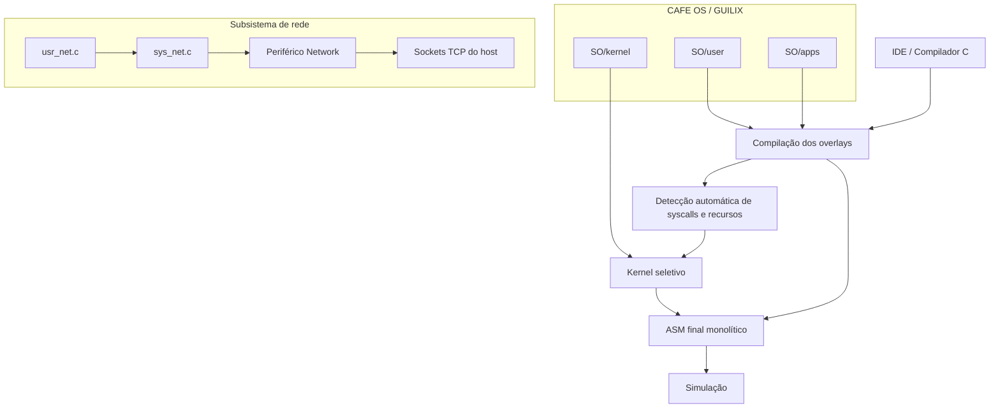
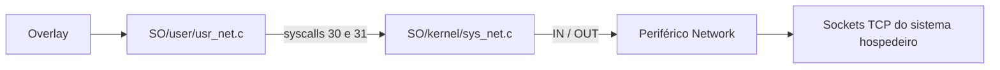

<div align="center">

# ☕ CAFE OS / GUILIX

### *Configurable And Flexible Environment Operating System*

**Um sistema operacional acadêmico, modular e extensível para estudos de kernel, compiladores, processos, escalonamento, memória, IPC, redes e aplicações de usuário em overlay.**

<br>


</div>

---

## ✨ Visão geral

O **CAFE OS**, codinome **GUILIX**, é um sistema operacional acadêmico desenvolvido para experimentação integrada com conceitos fundamentais de sistemas operacionais, compiladores e programação de aplicações em espaço de usuário.

O projeto adota o modelo:

> **Kernel modular + aplicações de usuário em overlay + build seletivo conduzido pela IDE**

Cada aplicação é mantida em um arquivo C próprio dentro de `SO/apps/`, com uma função `main()`. A IDE/Compilador:

1. compila os overlays selecionados;
2. detecta automaticamente as syscalls e os subsistemas necessários;
3. monta um kernel seletivo;
4. injeta as imagens dos overlays;
5. verifica os limites dos segmentos;
6. gera o ASM final monolítico para simulação.

A arquitetura permite evoluir o kernel e as aplicações de forma independente, mantendo o sistema pequeno o suficiente para o limite de **4096 palavras de instruções** e **4096 palavras no segmento de dados**.

<!-- VISUAL:DEMO:START -->
<div align="center">
  
  <br>
  <sub><strong>Demonstração:</strong> compilação, inicialização do kernel e execução de aplicações de usuário.</sub>
</div>
<!-- VISUAL:DEMO:END -->

---

## 🎯 Objetivos do projeto

O CAFE OS / GUILIX foi concebido como um laboratório didático para estudar, implementar e testar:

| Área | O que o projeto permite explorar |
|---|---|
| **Kernel** | boot, dispatcher, syscalls, serviços internos e tratamento de eventos |
| **Processos** | PCB, estados, criação, término, espera e troca de contexto |
| **Escalonamento** | Round-Robin, Prioridade Fixa e Prioridade Dinâmica com Aging |
| **Memória** | heap dinâmico, alocação, liberação e desfragmentação |
| **IPC** | pipes, memória compartilhada e mensageria simples |
| **Sincronização** | semáforos, mutexes e espera cooperativa |
| **Sinais** | registro de handlers, entrega, retorno, pausa e alarmes |
| **Threads** | fluxos experimentais compartilhando o domínio de memória |
| **Redes** | cliente e servidor TCP/IPv4 através de um periférico de rede |
| **Compilador/IDE** | geração de ASM, otimizações, kernel seletivo e análise de segmentos |
| **Userland** | bibliotecas pequenas e aplicações independentes em overlay |

---

## 🧠 Arquitetura conceitual



A IDE é o centro do fluxo de build. O desenvolvedor não precisa editar manualmente o kernel para adicionar uma aplicação: basta criar um arquivo em `SO/apps/` e selecioná-lo no modo **Kernel+Overlay**.

<!-- VISUAL:BUILD:START -->
<div align="center">
  
  <br>
  <sub>Fluxo integrado: compilação, detecção de syscalls, seleção do kernel e geração do ASM final.</sub>
</div>
<!-- VISUAL:BUILD:END -->

---

# 🚀 Recursos implementados

## 🧩 Kernel modular

O kernel foi dividido em módulos menores para facilitar manutenção, testes e inclusão seletiva.

```text
SO/kernel/
├── sys_main.c
├── sys_core.h
├── sys_mem.c
├── sys_sched_rr.c
├── sys_sched_fp.c
├── sys_sched_dp.c
├── sys_overlay.c
├── sys_proc_exit.c
├── sys_proc_wait.c
├── sys_proc_kill.c
├── sys_proc_sleep.c
├── sys_proc_spawn.c
├── sys_wakeup.c
├── sys_sem.c
├── sys_mutex.c
├── sys_pipe.c
├── sys_shm.c
├── sys_msg.c
├── sys_signal.c
├── sys_thread.c
├── sys_io.c
└── sys_net.c
```

No modo **Kernel+Overlay**, apenas os módulos necessários são incluídos no build final.

---

## 🔁 Escalonamento configurável

O CAFE OS / GUILIX mantém uma interface única, `schedule()`, cuja implementação pode ser substituída por diferentes políticas.

<div align="center">

| Arquivo | Política | Ideia central | Uso didático |
|---|---|---|---|
| `sys_sched_rr.c` | **Round-Robin** | percorre circularmente os processos `READY` | justiça simples e depuração |
| `sys_sched_fp.c` | **Prioridade Fixa** | seleciona o maior valor de `priority` | prioridade e starvation |
| `sys_sched_dp.c` | **Prioridade Dinâmica com Aging** | usa `priority + age` | mitigação de starvation |

</div>

### 🌀 Round-Robin

É a política recomendada para testes gerais:

- alterna circularmente entre os processos prontos;
- distribui a CPU de forma previsível;
- combina bem com `yield()`, `sleep()`, sinais, IPC e rede;
- usa *time warp* quando não há processo pronto, avançando `system_ticks` para acordar tarefas dormindo ou disparar alarmes.

### 🏁 Prioridade Fixa

Seleciona sempre o processo `READY` com maior prioridade base:

- favorece tarefas consideradas críticas;
- permite observar starvation de tarefas menos prioritárias;
- mantém o processamento de `sleep()` e alarmes durante períodos ociosos.

### 🌱 Prioridade Dinâmica com Aging

Calcula:

```text
effective_priority = priority + age
```

Processos prontos que continuam aguardando acumulam `age`. Quando um processo é escolhido, seu envelhecimento volta para zero.

- preserva a prioridade base;
- reduz o risco de starvation;
- demonstra uma política adaptativa de escalonamento.

### ⚙️ Seleção do escalonador

Mantenha somente uma implementação ativa:

```c
#include "kernel/sys_sched_rr.c"

// Alternativas:
// #include "kernel/sys_sched_fp.c"
// #include "kernel/sys_sched_dp.c"
```

> A troca do escalonador não exige qualquer alteração nos overlays.

### 📌 Estados de processo

| Estado | Significado | Impacto no escalonamento |
|---|---|---|
| `READY` | pronto para executar | candidato à CPU |
| `RUNNING` | em execução | volta a `READY` ao ser despromovido |
| `BLOCKED` | bloqueado por sincronização | ignorado até ser acordado |
| `TERMINATED` | finalizado | removido da seleção |
| `WAITING` | aguardando outro PID | acorda quando o alvo termina |
| `SLEEPING` | suspenso por ticks | acorda em `wakeup_tick` |
| `PAUSED` | suspenso aguardando sinal | acorda por sinal apropriado |
| `WAITING_PIPE_READ` | aguardando dados no pipe | acorda quando houver dados |
| `WAITING_PIPE_WRITE` | aguardando espaço no pipe | acorda quando houver espaço |

---

## 🧠 Gerenciamento de processos

O sistema utiliza uma tabela de **PCBs** (*Process Control Blocks*). Cada PCB armazena informações como:

- estado;
- contexto de execução;
- prioridade e aging;
- base de memória do overlay;
- informações de espera;
- temporização;
- sinais pendentes;
- recursos associados ao processo.

Chamadas principais:

```c
exit();
wait(pid);
kill(pid, signal);
yield();
spawn(...);
```

<!-- VISUAL:SPAWN:START -->
<div align="center">
  
  <br>
  <sub>O processo filho recebe PCB, pilha e domínio de dados próprios, preservando o isolamento lógico.</sub>
</div>
<!-- VISUAL:SPAWN:END -->

---

## 🧮 Gerenciamento de memória

O kernel possui heap dinâmico com política **First-Fit**, divisão de blocos e coalescência de áreas livres.

```c
malloc(size);
free(ptr);
kernel_defrag();
```

Esse heap é utilizado por processos criados dinamicamente, pilhas de overlays, memória compartilhada e outros serviços internos.

<!-- VISUAL:MEMORY:START -->
<div align="center">
  
  <br>
  <sub>Organização lógica de dados globais, heap, pilhas, processos, threads e memória compartilhada.</sub>
</div>
<!-- VISUAL:MEMORY:END -->

---

## 🔒 Sincronização

O sistema oferece:

- semáforo gerenciado pelo kernel;
- mutex/spinlock;
- `yield()` cooperativo em esperas ocupadas.

```c
sem_lock();
sem_unlock();
mutex_lock();
mutex_unlock();
```

A sincronização é especialmente importante para:

- mensagens concorrentes no vídeo;
- dados compartilhados entre threads;
- regiões críticas de IPC;
- cliente e servidor de rede executando simultaneamente.

---

## 📡 Comunicação entre processos

| Recurso | Descrição |
|---|---|
| **Pipes** | buffer circular com bloqueio de leitura e escrita |
| **Memória compartilhada** | blocos identificados por chave através de `shmget()` |
| **Mensageria** | envio e recepção de valores entre processos |

---

## 🚦 Sinais

Sinais básicos inspirados no modelo POSIX:

| Sinal | Uso |
|---|---|
| `SIGKILL` | finalização forçada |
| `SIGTERM` | solicitação de encerramento |
| `SIGALRM` | gerado por `alarm()` |
| `SIGCONT` | continuação de processo pausado |

Chamadas relacionadas:

```c
signal(handler);
sigreturn();
get_signal();
pause();
alarm(ticks);
```

---

## 🧵 Threads experimentais

`thread_create()` cria fluxos de execução que compartilham o domínio de memória do processo pai.

> ⚠️ O recurso é experimental. Proteja dados compartilhados com semáforos ou mutexes e evite rotinas não reentrantes em threads concorrentes.

<!-- VISUAL:THREADS:START -->
<div align="center">
  
  <br>
  <sub>Uma thread recebe contexto e pilha próprios, mas compartilha o segmento de dados com o processo pai.</sub>
</div>

<div align="center">
  
  <br>
  <sub><code>spawn()</code> cria um processo com dados isolados; <code>thread_create()</code> cria um fluxo com dados compartilhados.</sub>
</div>
<!-- VISUAL:THREADS:END -->

---

# 🌐 Suporte a redes TCP/IPv4

O CAFE OS / GUILIX possui suporte experimental a **cliente e servidor TCP/IPv4**, implementado em três camadas:



A pilha TCP/IP permanece no sistema hospedeiro. Para a aplicação Guilix, entretanto, a rede é acessada por uma API própria, mediada pelo kernel.

## 🧱 Componentes

| Camada | Arquivo | Responsabilidade |
|---|---|---|
| Userland | `SO/user/usr_net.c` | API TCP para os overlays |
| Kernel | `SO/kernel/sys_net.c` | validação, seleção de contexto e acesso ao periférico |
| Periférico | `devices/network/network.py` | sockets TCP não bloqueantes, FIFOs e estados |
| Descritor | `devices/network/network.csd` | registro das portas do dispositivo no simulador |

## 🔐 Isolamento de rede por processo

Operações de rede são compostas por vários acessos ao periférico. Como o escalonador pode trocar de processo entre duas syscalls, cliente e servidor poderiam interferir no socket ou endpoint um do outro.

A correção utiliza a porta privada:

```text
63 — CONTEXT/PID
```

Antes de cada `IN` ou `OUT`, `sys_net.c` informa o PID atual ao dispositivo. O periférico mantém um banco virtual de registradores para cada processo, incluindo:

- socket selecionado;
- IPv4 remoto ou local;
- porta TCP;
- backlog;
- resultado;
- erro;
- último comando;
- estado `WOULD_BLOCK`.

Os sockets e as FIFOs são reais, mas cada processo enxerga seu próprio contexto de controle.

> A porta 63 é de uso exclusivo do kernel e não pode ser acessada diretamente pelos overlays.

## 🔌 Portas do periférico

| Porta | Registro | Função |
|---:|---|---|
| 40 | `COMMAND` | executa comandos de rede |
| 41 | `STATUS` | informa estado e flags |
| 42 | `SOCKET` | seleciona socket |
| 43–44 | `RESULT` | resultado de 16 bits |
| 45–46 | `ERROR` | código de erro de 16 bits |
| 47–50 | `IP0..IP3` | endereço IPv4 |
| 51–52 | `PORT` | porta TCP em dois bytes |
| 53 | `TX_DATA` | escrita na FIFO de transmissão |
| 54–55 | `TX_COUNT` | bytes pendentes em transmissão |
| 56 | `RX_DATA` | leitura da FIFO de recepção |
| 57–58 | `RX_COUNT` | bytes disponíveis para leitura |
| 59 | `VERSION` | versão do periférico |
| 60 | `MAX_SOCKETS` | número máximo de sockets |
| 61 | `BACKLOG` | tamanho da fila de conexão |
| 62 | `SOCKET_STATE` | estado detalhado do socket |
| **63** | **CONTEXT/PID** | **seleção privada de contexto pelo kernel** |

## 📞 Syscalls de rede

A interface pública utiliza somente duas syscalls genéricas:

| ID | Nome | Descrição |
|---:|---|---|
| 30 | `net_out` | escrita validada nas portas lógicas 40–62 |
| 31 | `net_in` | leitura validada nas portas lógicas 40–62 |

A API cliente/servidor é construída em `usr_net.c`, reduzindo o tamanho do dispatcher e do driver do kernel.

## 🖧 API de cliente TCP

Principais funções:

```c
net_socket_tcp();
net_connect_ipv4(...);
net_wait_connected_socket(...);
net_send_text_socket(...);
net_wait_rx_socket(...);
net_recv_byte();
net_close_socket(...);
```

### Exemplo: simulador como cliente

```c
#include "../user/usr_net.c"
#include "../user/usr_printstr.c"
#include "../user/usr_exit.c"

int socket_id;
int connected;

void main() {
    socket_id = net_socket_tcp();

    if (socket_id >= 0) {
        // 192.168.1.50:8081
        // 8081 = low 145, high 31
        net_connect_ipv4(
            socket_id,
            192, 168, 1, 50,
            145, 31
        );

        connected = net_wait_connected_socket(socket_id, 600);

        if (connected == 1) {
            net_send_text_socket(socket_id, "OLA DO GUILIX\n");
            net_close_socket(socket_id);
        }
    }

    exit();
}
```

Esse formato permite conectar o cliente executado no simulador a um servidor em outro computador ou, futuramente, a um servidor executado no ESP32.

## 🗄️ API de servidor TCP

Principais funções:

```c
net_socket_tcp();
net_bind_ipv4(...);
net_listen_socket(...);
net_accept(...);
net_wait_accept(...);
net_wait_rx_socket(...);
net_recv_byte();
net_send_byte(...);
net_send();
net_close_socket(...);
```

### Exemplo: servidor acessível pela rede local

```c
server_socket = net_socket_tcp();

// 0.0.0.0:8081 — escuta em todas as interfaces do host
net_bind_ipv4(
    server_socket,
    0, 0, 0, 0,
    145, 31
);

net_listen_socket(server_socket, 2);
client_socket = net_wait_accept(server_socket, 1000);
```

Para um cliente externo se conectar, ele deve usar o endereço IP do computador que está executando o simulador.

## 📍 Configuração de IP e porta na aplicação

O endereço é definido diretamente pelo overlay:

```c
net_connect_ipv4(
    socket_id,
    ip0, ip1, ip2, ip3,
    port_low, port_high
);
```

A porta é separada em dois bytes:

```text
port_low  = porta % 256
port_high = porta / 256
```

| Porta | `port_low` | `port_high` |
|---:|---:|---:|
| 80 | 80 | 0 |
| 8080 | 144 | 31 |
| 8081 | 145 | 31 |
| 10000 | 16 | 39 |
| 12345 | 57 | 48 |

### Cenários típicos

| Cenário | Configuração |
|---|---|
| Cliente e servidor na mesma instância | servidor `127.0.0.1`, cliente `127.0.0.1` |
| Duas instâncias no mesmo computador | servidor e cliente em `127.0.0.1` |
| Simulador cliente → servidor externo/ESP32 | cliente usa o IP do servidor |
| Cliente externo/ESP32 → simulador servidor | servidor faz bind em `0.0.0.0`; cliente usa o IP do computador |

> Em conexões externas, verifique também o firewall do sistema hospedeiro.

## 🧪 Aplicações de rede incluídas

| Arquivo | Finalidade |
|---|---|
| `app_net_client.c` | cliente pareado com o servidor Guilix em `127.0.0.1:8081` |
| `app_net_server.c` | servidor de eco Guilix em `127.0.0.1:8081` |
| `app_net_client_host.c` | cliente para o servidor de eco do host em `127.0.0.1:8080` |
| `app_net_echo.c` | exemplo adicional de eco TCP |
| `_template_network_client.c` | template para novos clientes |
| `_template_network_server.c` | template para novos servidores |
| `_template_network.c` | template de rede genérico |

## 🧪 Cliente e servidor na mesma instância

Selecione os overlays nesta ordem:

```text
1. SO/apps/app_net_server.c
2. SO/apps/app_net_client.c
```

O cliente possui um pequeno atraso cooperativo para dar ao servidor tempo de executar `bind()` e `listen()`.

Saída esperada:

```text
NET SERVER: ouvindo 8081
NET CLIENT: iniciando
NET CLIENT: conectado
NET SERVER: cliente aceito
NET SERVER RX: OLA DO CLIENTE GUILIX
NET CLIENT RX: OLA DO CLIENTE GUILIX
NET SERVER: encerrado
```

As mensagens são protegidas por semáforo para evitar mistura caractere a caractere no vídeo.

## ⚡ Desempenho da simulação

A comunicação integrada cliente-servidor demanda muitos ciclos simulados. Duas instâncias completas do simulador duplicam o custo de emulação e podem aparentar travamento em máquinas com menos recursos.

Para testes iniciais:

1. prefira uma única instância;
2. selecione o servidor antes do cliente;
3. use o modo rápido/otimizado;
4. desabilite logs por instrução e visualizações não essenciais.

---

# 📁 Estrutura do projeto

```text
CAFE_OS/
├── README.md
│
├── docs/
│   ├── cafe_os_demo_long.gif
│   ├── arquitetura_build.svg
│   ├── mapa_memoria.svg
│   ├── processo_spawn.svg
│   ├── thread_create.svg
│   ├── spawn_vs_thread.svg
│   ├── syscall_desempenho.svg
│   └── README_REDE_SO.md
│
├── IDE_CompiladorC/
│   ├── IDE_GCC.py
│   ├── build_modes.py
│   ├── codegen.py
│   ├── parser.py
│   ├── semantic.py
│   ├── optimizer.py
│   ├── preprocess.py
│   ├── lexer.py
│   ├── formatter.py
│   └── gera_IDE.sh
│
├── SO/
│   ├── KERNEL.c
│   │
│   ├── kernel/
│   │   ├── sys_main.c
│   │   ├── sys_core.h
│   │   ├── sys_mem.c
│   │   ├── sys_sched_rr.c
│   │   ├── sys_sched_fp.c
│   │   ├── sys_sched_dp.c
│   │   ├── sys_overlay.c
│   │   ├── sys_proc_*.c
│   │   ├── sys_sem.c
│   │   ├── sys_mutex.c
│   │   ├── sys_pipe.c
│   │   ├── sys_shm.c
│   │   ├── sys_msg.c
│   │   ├── sys_signal.c
│   │   ├── sys_thread.c
│   │   ├── sys_io.c
│   │   └── sys_net.c
│   │
│   ├── user/
│   │   ├── usr_exit.c
│   │   ├── usr_yield.c
│   │   ├── usr_sleep.c
│   │   ├── usr_print_char.c
│   │   ├── usr_read_char.c
│   │   ├── usr_printstr.c
│   │   ├── usr_printint.c
│   │   ├── usr_sync.c
│   │   ├── usr_pipe.c
│   │   ├── usr_shm.c
│   │   ├── usr_msg.c
│   │   ├── usr_signal.c
│   │   ├── usr_thread.c
│   │   ├── usr_net.c
│   │   └── usr_syscalls.c
│   │
│   ├── apps/
│   │   ├── app_hello.c
│   │   ├── app_counter.c
│   │   ├── app_net_client.c
│   │   ├── app_net_server.c
│   │   ├── app_net_client_host.c
│   │   ├── app_net_echo.c
│   │   └── _template_*.c
│   │
│   ├── docs/
│   └── build/
│
├── devices/
│   └── network/
│       ├── network.py
│       └── network.csd
│
└── tests/
    ├── echo_server.py
    ├── tcp_client_host.py
    ├── test_network_core_client_server.py
    ├── test_network_context_isolation.py
    └── test_build_network_os.py
```

---

# 🧭 Fluxo de compilação na IDE

| Modo | Uso recomendado |
|---|---|
| **Full** | compilar um programa C tradicional |
| **Kernel** | inspecionar a compilação do kernel completo |
| **Overlay** | validar uma aplicação isoladamente |
| **Kernel+Overlay** | gerar a imagem executável com kernel seletivo |

## 🚀 Build recomendado

```text
1. Abrir SO/KERNEL.c
2. Selecionar Kernel+Overlay
3. Escolher um ou mais arquivos de SO/apps/
4. Conferir o relatório de código e dados
5. Executar o ASM final no simulador
```

> O modo executável recomendado é **Kernel+Overlay**. O kernel completo de fallback pode ultrapassar o limite de instruções e é mais apropriado para inspeção.

---

# ⚙️ Kernel seletivo

A IDE analisa os overlays e inclui apenas os módulos necessários.

| Se o overlay usa... | O kernel inclui... |
|---|---|
| `printstr()` / `print_char()` | saída de caracteres |
| `read_char()` | entrada de teclado |
| `exit()` | término de processos |
| `sleep()` | temporização e estado `SLEEPING` |
| `sem_lock()` / `mutex_lock()` | sincronização |
| `write_pipe()` / `read_pipe()` | pipes |
| `shmget()` | memória compartilhada |
| `msg_send()` / `msg_recv()` | mensageria |
| `signal()` / `pause()` / `alarm()` | sinais |
| `thread_create()` | threads experimentais |
| `usr_net.c` / API `net_*` | driver `sys_net.c` e syscalls 30/31 |

A IDE também informa:

- palavras de instrução usadas;
- dados globais;
- BSS;
- pilha;
- imagens dos overlays;
- margem restante em cada segmento.

Builds que ultrapassam 4096 palavras em qualquer segmento são bloqueados.

---

# 📏 Limites de 4K e impacto da rede

O projeto utiliza dois limites independentes:

| Segmento | Limite | Inclui |
|---|---:|---|
| **Instruções** | 4096 palavras | código do kernel selecionado |
| **Dados** | 4096 palavras | dados, BSS, pilha e imagens compactas dos overlays |

> As instruções dos overlays são armazenadas inicialmente como imagens no segmento de dados do kernel. Por isso, múltiplos overlays grandes pressionam principalmente o segmento de dados.

## Medições da versão com rede e isolamento por PID

| Cenário | Instruções | Livres em código | Dados + BSS + pilha + overlays | Livres em dados |
|---|---:|---:|---:|---:|
| Kernel + `app_hello` | 2582 | 1514 | 737 | 3359 |
| Kernel + cliente externo | 2729 | 1367 | 1993 | 2103 |
| Kernel + cliente pareado | 2924 | 1172 | 2099 | 1997 |
| Kernel + servidor pareado | 2924 | 1172 | 2110 | 1986 |
| **Kernel + servidor + cliente** | **2932** | **1164** | **3603** | **493** |

O build combinado permanece válido, porém a margem de dados é pequena. A IDE apresenta um alerta quando restam menos de 512 palavras em qualquer segmento.

## Imagens dos overlays de rede

| Overlay | Código lógico | Dados | Pilha lógica | Imagem injetada |
|---|---:|---:|---:|---:|
| `app_net_server.c` | 1242 | 254 | 100 | 1502 palavras |
| `app_net_client.c` | 1232 | 253 | 100 | 1491 palavras |

As duas imagens ocupam 2993 palavras no segmento de dados. Para aplicações maiores, recomenda-se testar cliente e servidor em builds separados.

## Memória física recomendada

O build combinado ocupa aproximadamente 7599 palavras físicas. Portanto:

- configuração com 4096 palavras: insuficiente;
- configuração com 8192 palavras: suficiente;
- configurações maiores oferecem melhor margem para evolução.

---

# 📚 Bibliotecas de usuário

Inclua apenas os módulos necessários para reduzir o tamanho do overlay.

| Biblioteca | Funções principais |
|---|---|
| `usr_exit.c` | `exit()` |
| `usr_yield.c` | `yield()` |
| `usr_sleep.c` | `sleep()` |
| `usr_print_char.c` | `print_char()` |
| `usr_read_char.c` | `read_char()` |
| `usr_printstr.c` | `printstr()` |
| `usr_printint.c` | `printint()` |
| `usr_sync.c` | semáforos e mutexes |
| `usr_pipe.c` | pipes |
| `usr_shm.c` | memória compartilhada |
| `usr_msg.c` | mensageria |
| `usr_signal.c` | sinais |
| `usr_thread.c` | threads |
| `usr_net.c` | cliente e servidor TCP/IPv4 |
| `usr_syscalls.c` | agregador de compatibilidade |

> Para overlays novos, prefira módulos pequenos e específicos. Use `usr_syscalls.c` apenas quando a compatibilidade com código legado for necessária.

---

# 🛠️ Criando uma aplicação

## Exemplo mínimo

```c
#include "../user/usr_exit.c"

void main() {
    exit();
}
```

## Exemplo com texto

```c
#include "../user/usr_printstr.c"
#include "../user/usr_exit.c"

void main() {
    printstr("Minha aplicacao\n");
    exit();
}
```

## Exemplo cooperativo

```c
#include "../user/usr_printstr.c"
#include "../user/usr_yield.c"

void main() {
    while (1) {
        printstr("rodando\n");
        yield();
    }
}
```

## Exemplo de rede

Use como ponto de partida:

```text
SO/apps/_template_network_client.c
SO/apps/_template_network_server.c
```

---

# 🧪 Tarefas antigas convertidas para overlays

O modelo anterior utilizava:

```c
naked void task_a() { ... }
naked void task_b() { ... }
```

Na estrutura atual, cada tarefa é uma aplicação independente com `main()`.

```text
usr_tasks_1.c
    ├── legado_01_counter_a.c
    └── legado_01_counter_b.c
```

A ordem de seleção define os PIDs iniciais:

```text
primeiro overlay selecionado -> PID 0
segundo overlay selecionado  -> PID 1
```

Isso é importante em testes com `wait(pid)`, `kill(pid, ...)`, sinais e IPC.

---

<!-- VISUAL:SYSCALL:START -->
# ⚡ Caminho das syscalls e reescalonamento

As chamadas de sistema entram no kernel por um dispatcher comum. Operações leves podem concluir e retornar ao contexto corrente, enquanto operações que bloqueiam ou cedem a CPU acionam o escalonador. Essa distinção ajuda a reduzir trabalho desnecessário no caminho crítico.

<div align="center">
  
  <br>
  <sub>Syscalls leves retornam diretamente; syscalls bloqueantes ou cooperativas passam pelo escalonador.</sub>
</div>

---

<!-- VISUAL:SYSCALL:END -->
# 📞 Tabela de syscalls

| ID | Função | Descrição |
|---:|---|---|
| 1 | `exit` | encerra o processo atual |
| 2 | `wait` | aguarda o término de um PID |
| 3 | `kill` | envia sinal a um processo |
| 4 | `sem_lock` | obtém o semáforo do kernel |
| 5 | `sem_unlock` | libera o semáforo do kernel |
| 6 | `spawn` | cria processo dinamicamente |
| 7 | `mutex_try` | tenta obter mutex |
| 8 | `mutex_unlock` | libera mutex |
| 9 | `yield` | cede voluntariamente a CPU |
| 10 | `print_char` | escreve caractere |
| 11 | `read_char` | lê caractere |
| 12 | `sleep` | suspende por N ticks |
| 13 | `alarm` | agenda `SIGALRM` |
| 14 | `pause` | suspende até receber sinal |
| 15 | `signal` | registra handler |
| 16 | `sigreturn` | retorna do handler |
| 17 | `get_signal` | obtém sinal pendente |
| 20 | `write_pipe` | escreve no pipe |
| 21 | `read_pipe` | lê do pipe |
| 25 | `shmget` | obtém memória compartilhada |
| 27 | `msg_send` | envia mensagem |
| 28 | `msg_recv` | recebe mensagem |
| 29 | `thread_create` | cria thread compartilhando memória |
| **30** | **`net_out`** | **escreve em registrador lógico de rede** |
| **31** | **`net_in`** | **lê registrador lógico de rede** |

---

# 🔧 Instalação do periférico de rede

Copie:

```text
devices/network/
```

para a pasta `devices/` da instalação do simulador e reinicie completamente a aplicação.

Também é possível usar:

```bash
chmod +x instalar_periferico.sh
./instalar_periferico.sh /caminho/para/o/CompSim
```

Depois selecione o periférico **Network** na configuração do sistema.

---

# ✅ Boas práticas para overlays

- Use `void main()` como ponto de entrada.
- Inclua apenas as bibliotecas necessárias.
- Chame `exit()` ao finalizar.
- Em laços contínuos, use `yield()` quando possível.
- Proteja regiões críticas com semáforo ou mutex.
- Selecione overlays na ordem correta quando o teste depender de PID.
- Para rede, mantenha IP e porta em constantes ou variáveis globais fáceis de alterar.
- Em servidores externos, use `0.0.0.0` no `bind()` quando precisar aceitar conexões da rede local.
- Verifique o relatório de segmentos antes de executar.

---

# 🧱 Boas práticas para evoluir o kernel

```text
1. Criar um módulo em SO/kernel/
2. Criar a biblioteca correspondente em SO/user/
3. Adicionar a detecção seletiva em build_modes.py
4. Criar uma aplicação de teste em SO/apps/
5. Validar em modo Overlay
6. Validar em modo Kernel+Overlay
7. Conferir os limites de código e dados
```

Mantenha `SO/KERNEL.c` pequeno e não inclua aplicações diretamente nele.

---

# 🖥️ Gerando o executável da IDE

```bash
cd IDE_CompiladorC
chmod +x gera_IDE.sh
./gera_IDE.sh pyinstaller
```

ou:

```bash
./gera_IDE.sh nuitka
```

Os artefatos são gerados em:

```text
IDE_CompiladorC/dist/
```

---

# 🧭 Fluxo recomendado de trabalho

## Evoluir o kernel

```text
1. Alterar SO/kernel/
2. Abrir SO/KERNEL.c
3. Compilar para inspeção
4. Compilar Kernel+Overlay com app_hello.c
5. Conferir uso dos segmentos
```

## Criar uma aplicação

```text
1. Criar o arquivo em SO/apps/
2. Incluir somente as bibliotecas necessárias
3. Implementar void main()
4. Compilar em modo Overlay
5. Testar em Kernel+Overlay
```

## Testar rede

```text
1. Instalar e selecionar o periférico Network
2. Selecionar os overlays de rede
3. Conferir IP e porta no código da aplicação
4. Compilar em Kernel+Overlay
5. Verificar as margens de 4K
6. Executar em modo rápido
```

---

# 🧾 Resumo executivo

O **CAFE OS / GUILIX** organiza o sistema em três camadas principais:

```text
SO/kernel/ -> serviços privilegiados e gerenciamento de recursos
SO/user/   -> API disponível às aplicações
SO/apps/   -> programas independentes em overlay
```

A rede segue a mesma filosofia:

```text
usr_net.c -> sys_net.c -> periférico Network -> TCP/IP do host
```

A IDE coordena o build, seleciona os módulos, injeta os overlays e impede que os segmentos ultrapassem os limites arquiteturais.

<div align="center">

---

### ☕ CAFE OS / GUILIX

**Um laboratório vivo para aprender, testar e evoluir sistemas operacionais, compiladores, redes e aplicações em espaço de usuário.**

</div>
