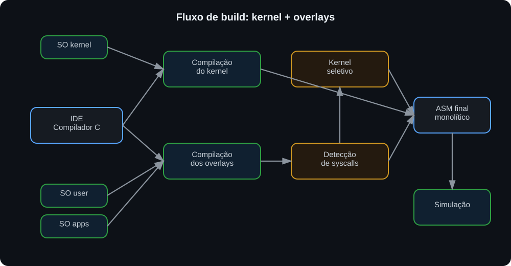
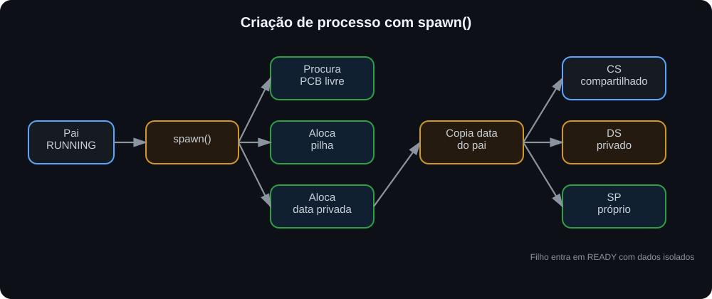
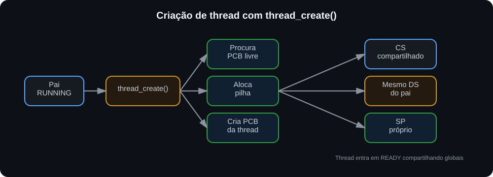
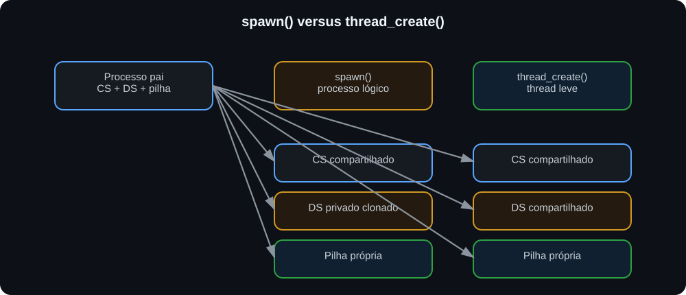
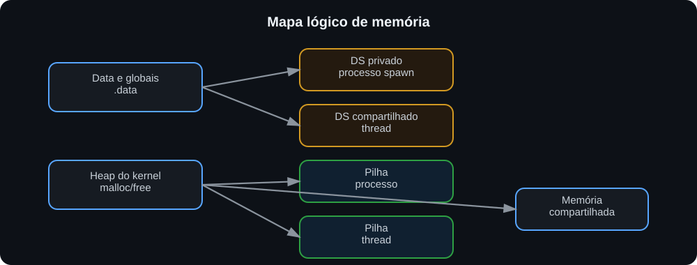
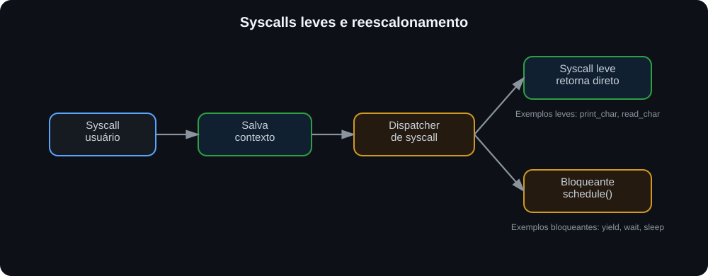

<div align="center">

# ☕ CAFE OS / GUILIX

### *Configurable And Flexible Environment Operating System*

**Um sistema operacional acadêmico, modular e extensível para estudos de kernel, compiladores, escalonamento, syscalls, IPC e aplicações de usuário em overlay.**

<br>


</div>

---

## ✨ Visão geral

O **CAFE OS**, codinome **GUILIX**, é um sistema operacional acadêmico desenvolvido para experimentação com conceitos fundamentais de sistemas operacionais e compiladores.

O projeto foi reorganizado para adotar o modelo:

> **Kernel fixo + aplicações de usuário em overlay**

Nesse modelo, o kernel evolui de forma independente das aplicações. Cada aplicação de usuário é um arquivo C próprio, localizado em `SO/apps/`, contendo uma função `main()`. A IDE/Compilador se encarrega de compilar o kernel, compilar os overlays selecionados, injetá-los no ASM final e gerar um sistema monolítico pronto para simulação.

---

## 🧱 Perfil atual de execução

A versão atual documentada neste README usa um perfil conservador para manter compatibilidade com a arquitetura segmentada da CPU Cariri:

| Recurso | Limite adotado |
|---|---:|
| Código por segmento (`CS`) | 4K palavras |
| Dados + heap + pilhas (`DS/SS`) | 4K palavras |
| Tarefas simultâneas | 3 |
| Pilha padrão por tarefa | 64 palavras |
| Heap do kernel | 512 palavras |

Esse perfil favorece previsibilidade durante a simulação e reduz o risco de colisão entre dados, heap, pilhas e imagens de overlays.

---

## 🎯 Objetivos do projeto

O CAFE OS / GUILIX foi pensado como um ambiente didático para estudar, implementar e testar:

| Área | O que o projeto permite explorar |
|---|---|
| **Kernel** | boot, dispatcher, syscalls, processos e serviços internos |
| **Processos** | PCB, estados, escalonamento, troca de contexto e `spawn()` com `.data` privada |
| **Memória** | heap dinâmico, pilhas de tarefas, cópia privada de dados e desfragmentação |
| **IPC** | pipes, memória compartilhada e mensageria simples |
| **Sincronização** | semáforo, mutex/spinlock e yield cooperativo |
| **Sinais** | `signal()`, `sigreturn()`, `pause()`, `alarm()` e `kill()` |
| **Threads** | `thread_create()` com memória compartilhada e `thread_exit()` para encerramento seguro |
| **Compilador** | geração de ASM, otimização e kernel seletivo |
| **Userland** | aplicações independentes em formato overlay, incluindo mini shell interativo |

---

## 🧠 Arquitetura conceitual

<p align="center">
  
</p>

A IDE é o centro do fluxo de build. O desenvolvedor não precisa editar manualmente o kernel para adicionar novas aplicações: basta criar um arquivo em `SO/apps/` e selecioná-lo no modo **Kernel+Overlay**.

> Observação: os gráficos deste README são imagens SVG versionadas em `docs/img/`, evitando problemas de renderização Mermaid no GitHub.

---

## 🚀 Principais recursos implementados

### 🧩 Kernel modular

O kernel foi dividido em módulos menores, facilitando evolução, testes e inclusão seletiva no ASM final.

Principais módulos:

```text
SO/kernel/
├── sys_main.c
├── sys_core.h
├── sys_proc.c
├── sys_mem.c
├── sys_sched_rr.c
├── sys_sched_fp.c
├── sys_sched_dp.c
├── sys_overlay.c
├── sys_proc_exit.c
├── sys_proc_wait.c
├── sys_proc_kill.c
├── sys_proc_sleep.c
├── sys_proc_spawn.c
├── sys_wakeup.c
├── sys_sem.c
├── sys_mutex.c
├── sys_pipe.c
├── sys_shm.c
├── sys_msg.c
├── sys_thread.c
├── sys_thread_exit.c
└── sys_io.c
```

### 🔁 Escalonamento configurável

O CAFE OS / GUILIX possui uma camada de escalonamento modular. O kernel mantém uma única função pública de escalonamento, `schedule()`, mas a implementação pode ser trocada incluindo um dos módulos disponíveis em `SO/kernel/`.

<div align="center">

| Arquivo | Política | Ideia central | Uso didático |
|---|---|---|---|
| `sys_sched_rr.c` | **Round-Robin** | alterna circularmente entre processos `READY` | justiça simples e multiprogramação básica |
| `sys_sched_fp.c` | **Prioridade Fixa** | escolhe o processo pronto com maior `priority` | estudo de prioridade e risco de starvation |
| `sys_sched_dp.c` | **Prioridade Dinâmica com Aging** | usa `priority + age` para favorecer quem espera | prioridade com mitigação de starvation |

</div>

#### 🌀 Round-Robin — `sys_sched_rr.c`

É o escalonador padrão recomendado para testes gerais. Ele percorre circularmente a tabela de PCBs, a partir do processo atual, até encontrar o próximo processo em estado `READY`.

Características:

- simples, previsível e adequado para depuração;
- distribui a CPU entre processos prontos;
- combina bem com `yield()`, `sleep()`, pipes, sinais e overlays simples;
- usa *time warp* quando todos os processos estão dormindo ou bloqueados, avançando `system_ticks` até alguém ficar pronto.

#### 🏁 Prioridade Fixa — `sys_sched_fp.c`

Seleciona sempre o processo `READY` com maior valor de `priority`. Em caso de empate, vence o primeiro encontrado na tabela de processos.

Características:

- favorece tarefas críticas com prioridade maior;
- útil para demonstrar inversão de prioridade e starvation;
- processos de baixa prioridade podem demorar muito para executar se houver processos de alta prioridade sempre prontos;
- também possui *time warp* para acordar processos em `SLEEPING` e tratar alarmes quando a CPU ficaria ociosa.

#### 🌱 Prioridade Dinâmica com Aging — `sys_sched_dp.c`

Calcula uma prioridade efetiva para cada processo pronto:

```text
effective_priority = priority + age
```

A cada ciclo de busca, processos `READY` que continuam esperando aumentam seu `age`. Quando um processo ganha a CPU, seu `age` volta para zero.

Características:

- mantém a noção de prioridade;
- reduz o risco de starvation;
- favorece gradualmente processos que esperaram mais tempo;
- é o melhor escalonador para demonstrar políticas adaptativas.

#### ⚙️ Como escolher o escalonador

No kernel, mantenha **apenas um** escalonador ativo por vez:

```c
// Escalonador padrão
#include "kernel/sys_sched_rr.c"

// Alternativas:
// #include "kernel/sys_sched_fp.c"
// #include "kernel/sys_sched_dp.c"
```

> ✅ A troca do escalonador não exige alterar os overlays. As aplicações continuam usando `main()`, `yield()`, `sleep()`, `wait()`, `exit()` e demais syscalls normalmente.

#### 📌 Estados de processo suportados

| Estado | Significado | Impacto no escalonamento |
|---|---|---|
| `READY` | Processo pronto para executar | candidato à CPU |
| `RUNNING` | Processo em execução | volta para `READY` ao ser despromovido |
| `BLOCKED` | Bloqueado por sincronização | ignorado até ser acordado |
| `TERMINATED` | Finalizado | ignorado definitivamente |
| `WAITING` | Aguardando outro processo | acorda quando o alvo termina |
| `SLEEPING` | Dormindo por número de ticks | acorda quando `system_ticks >= wakeup_tick` |
| `PAUSED` | Pausado até receber sinal | acorda com sinal apropriado |
| `WAITING_PIPE_READ` | Aguardando leitura em pipe | acorda quando houver dado |
| `WAITING_PIPE_WRITE` | Aguardando escrita em pipe | acorda quando houver espaço |

#### 🧪 Testando políticas de escalonamento

Sugestões de testes:

| Cenário | Escalonador recomendado | O que observar |
|---|---|---|
| Dois contadores infinitos | `sys_sched_rr.c` | alternância regular entre processos |
| Processos com prioridades diferentes | `sys_sched_fp.c` | preferência por maior prioridade |
| Processo de baixa prioridade esperando muito | `sys_sched_dp.c` | aumento gradual da chance de execução |
| Apps com `sleep()` | qualquer um | avanço de `system_ticks` e reativação por tick |
| Apps com `wait()` e `exit()` | qualquer um | mudança de `WAITING` para `READY` |


### 🧠 Gerenciamento de processos e tarefas

O sistema utiliza uma tabela de **PCBs** (*Process Control Blocks*). Cada entrada representa uma tarefa escalonável, isto é, algo que pode receber a CPU: processo principal de overlay, processo criado por `spawn()` ou thread criada por `thread_create()`.

No perfil atual, o CAFE OS trabalha de forma conservadora com:

```text
máximo de tarefas simultâneas: 3
código por segmento: até 4K palavras
dados + heap + pilhas por segmento: até 4K palavras
pilha padrão por tarefa: 64 palavras
heap padrão do kernel: 512 palavras
```

Chamadas principais:

```c
exit();
wait(pid);
kill(pid, signal);
yield();
spawn(task_addr, priority);
thread_create(task_addr, priority);
thread_exit();
```

#### 🧬 Processo criado com `spawn()`

`spawn()` cria um **processo lógico**. O filho recebe PID próprio, pilha própria e uma cópia privada da área `.data` do pai. O código é compartilhado, mas os dados globais passam a ser independentes.

<p align="center">
  
</p>

Resumo:

| Recurso | `spawn()` |
|---|---|
| PID próprio | Sim |
| Pilha própria | Sim |
| Código (`CS`) | Compartilhado com o pai |
| Dados (`DS`) | Privados, clonados da `.data` do pai |
| Globais C | Independentes após o clone |
| Encerramento | `exit()` |
| Uso recomendado | processo lógico, tarefa independente, teste de isolamento de dados |

#### 🧵 Thread criada com `thread_create()`

`thread_create()` cria uma **thread leve**. A thread recebe PID próprio e pilha própria, mas compartilha o mesmo domínio de dados do processo pai. Isso significa que variáveis globais são compartilhadas intencionalmente.

<p align="center">
  
</p>

Resumo:

| Recurso | `thread_create()` |
|---|---|
| PID próprio | Sim |
| Pilha própria | Sim |
| Código (`CS`) | Compartilhado com o pai |
| Dados (`DS`) | Compartilhados com o pai |
| Globais C | Compartilhadas |
| Encerramento | `thread_exit()` |
| Uso recomendado | produtor/consumidor, tarefas cooperativas, fluxos concorrentes sobre os mesmos dados |

#### 📊 Comparação visual: `spawn()` versus `thread_create()`

<p align="center">
  
</p>

#### 🧱 Mapa lógico de memória

<p align="center">
  
</p>

#### 🧾 Regras de encerramento

| Chamada | Quem deve usar | O que libera |
|---|---|---|
| `exit()` | processo principal ou processo criado por `spawn()` | pilha própria e, quando aplicável, `.data` privada |
| `thread_exit()` | thread criada por `thread_create()` | somente a pilha própria da thread |
| `kill(pid, SIGKILL)` | outro processo/thread | recursos da tarefa alvo de acordo com seu tipo |

> ⚠️ Uma função de thread não deve terminar por `return`. Use `thread_exit()` para evitar retorno para um frame sintético inválido.


### 🧮 Heap dinâmico

O kernel possui um heap com política **First-Fit** e suporte a coalescência de blocos livres.

Funções principais:

```c
malloc(size);
free(ptr);
kernel_defrag();
```

### 🔒 Sincronização

O sistema implementa sincronização por:

- semáforo com bloqueio no kernel;
- mutex/spinlock;
- `yield()` cooperativo em esperas ocupadas.

Chamadas de usuário:

```c
sem_lock();
sem_unlock();
mutex_lock();
mutex_unlock();
```

### 📡 IPC: comunicação entre processos

Recursos disponíveis:

| Recurso | Descrição |
|---|---|
| **Pipes** | Buffer circular com bloqueio de leitura/escrita |
| **Memória compartilhada** | Blocos identificados por chave via `shmget()` |
| **Mensagens** | Envio e recepção simples de valores entre processos |

### 🚦 Sinais

Sinais básicos inspirados no modelo POSIX:

| Sinal | Uso |
|---|---|
| `SIGKILL` | Finalização forçada |
| `SIGTERM` | Pedido de encerramento |
| `SIGALRM` | Gerado por `alarm()` |
| `SIGCONT` | Continuação de processo pausado |

Chamadas relacionadas:

```c
signal(handler);
sigreturn();
get_signal();
pause();
alarm(ticks);
```

### 🧵 Threads experimentais

O suporte a `thread_create()` permite criar fluxos de execução concorrentes que compartilham o domínio de memória do processo pai, mas possuem pilha própria. Threads são úteis para cenários como produtor/consumidor, tarefas periódicas e concorrência cooperativa dentro do mesmo overlay.

Funções principais:

```c
thread_create(addr_funcao, prioridade);
thread_exit();
```

> ⚠️ **Atenção:** esse recurso é experimental. Use semáforos ao compartilhar dados e evite funções não reentrantes em threads concorrentes. Ao finalizar uma thread, use `thread_exit()` em vez de `return`.

---

## 📁 Nova estrutura do projeto

```text
CAFE_OS/
├── IDE_CompiladorC/
│   ├── IDE_GCC.py
│   ├── build_modes.py
│   ├── codegen.py
│   ├── parser.py
│   ├── semantic.py
│   ├── optimizer.py
│   ├── preprocess.py
│   ├── lexer.py
│   ├── formatter.py
│   └── gera_IDE.sh
│
└── SO/
    ├── KERNEL.c
    │
    ├── kernel/
    │   ├── sys_main.c
    │   ├── sys_core.h
    │   ├── sys_proc.c
    │   ├── sys_mem.c
    │   ├── sys_sched_rr.c
    │   ├── sys_overlay.c
    │   ├── sys_proc_exit.c
    │   ├── sys_proc_wait.c
    │   ├── sys_proc_kill.c
    │   ├── sys_proc_sleep.c
    │   ├── sys_proc_spawn.c
    │   ├── sys_wakeup.c
    │   ├── sys_sem.c
    │   ├── sys_mutex.c
    │   ├── sys_pipe.c
    │   ├── sys_shm.c
    │   ├── sys_msg.c
    │   ├── sys_thread.c
    │   ├── sys_thread_exit.c
    │   └── sys_io.c
    │
    ├── user/
    │   ├── usr_exit.c
    │   ├── usr_yield.c
    │   ├── usr_sleep.c
    │   ├── usr_print_char.c
    │   ├── usr_read_char.c
    │   ├── usr_printstr.c
    │   ├── usr_printint.c
    │   ├── usr_sync.c
    │   ├── usr_pipe.c
    │   ├── usr_shm.c
    │   ├── usr_msg.c
    │   ├── usr_signal.c
    │   ├── usr_thread.c
    │   └── usr_syscalls.c
    │
    ├── apps/
    │   ├── app_hello.c
    │   ├── app_counter.c
    │   ├── legado_16_keyboard_echo.c
    │   ├── legado_19_shell.c
    │   ├── _template_minimal.c
    │   └── _template_stdio.c
    │
    ├── legacy/
    ├── docs/
    └── build/
```

---

## 🧭 Fluxo de compilação na IDE

A IDE/Compilador possui quatro modos principais.

| Modo | Uso recomendado |
|---|---|
| **Full** | Compilar um arquivo C como programa completo tradicional |
| **Kernel** | Compilar somente `SO/KERNEL.c` |
| **Overlay** | Compilar somente uma aplicação em `SO/apps/` |
| **Kernel+Overlay** | Compilar kernel e injetar uma ou mais aplicações de usuário |

### 🧱 Compilar o kernel

```text
1. Abrir SO/KERNEL.c
2. Clicar em Kernel
3. Verificar o ASM gerado
```

### 📦 Compilar um overlay isolado

```text
1. Abrir um arquivo em SO/apps/
2. Clicar em Overlay
3. Verificar se o overlay compila corretamente
```

### 🚀 Compilar kernel com overlays

```text
1. Abrir SO/KERNEL.c
2. Clicar em Kernel+Overlay
3. Selecionar um ou mais arquivos em SO/apps/
4. A IDE gera o ASM final monolítico
```

> ✅ Não é necessário editar includes manualmente nem executar scripts auxiliares. A IDE cria as configurações virtuais necessárias durante a compilação.

---

## ⚡ Otimizações de desempenho no kernel

O kernel seletivo também adota uma política simples para reduzir trocas de contexto desnecessárias.

A ideia central é separar syscalls em dois grupos:

| Tipo de syscall | Exemplos | Comportamento |
|---|---|---|
| **Leves** | `print_char`, `read_char`, `get_signal`, `msg_send`, `msg_recv`, `shmget`, `signal`, `sigreturn` | retornam ao processo atual sem escalonamento obrigatório |
| **Bloqueantes ou estruturais** | `yield`, `exit`, `wait`, `kill`, `sleep`, `pause`, `sem_lock`, `sem_unlock`, `spawn`, `thread_create`, `thread_exit` | marcam necessidade de reescalonamento |

Fluxo simplificado:

<p align="center">
  
</p>

Essa estratégia melhora principalmente aplicações que imprimem muitos caracteres, porque `printstr()` chama `print_char()` repetidamente. Sem essa otimização, cada caractere poderia provocar uma passagem completa pelo escalonador.

---

## ⚙️ Kernel seletivo

No modo **Kernel+Overlay**, a IDE analisa os overlays selecionados e detecta quais syscalls são usadas.

Com isso, o kernel final inclui apenas os módulos necessários.

| Se o overlay usa... | O kernel inclui... |
|---|---|
| `printstr()` / `print_char()` | Suporte de saída |
| `exit()` | Finalização de processo |
| `sleep()` | Temporização e estado `SLEEPING` |
| `sem_lock()` / `mutex_lock()` | Sincronização |
| `write_pipe()` / `read_pipe()` | Pipes |
| `shmget()` | Memória compartilhada |
| `signal()` / `pause()` / `alarm()` | Sinais |
| `thread_create()` / `thread_exit()` | Threads experimentais com pilha própria |

Essa estratégia reduz o tamanho do ASM final e mantém o kernel mais fácil de evoluir.

---

## 📚 Bibliotecas de usuário

Para reduzir o tamanho dos overlays, inclua apenas as bibliotecas necessárias.

| Biblioteca | Funções |
|---|---|
| `usr_exit.c` | `exit()` |
| `usr_yield.c` | `yield()` |
| `usr_sleep.c` | `sleep()` |
| `usr_print_char.c` | `print_char()` |
| `usr_read_char.c` | `read_char()` |
| `usr_printstr.c` | `printstr()` |
| `usr_printint.c` | `printint()` |
| `usr_sync.c` | `sem_lock()`, `sem_unlock()`, `mutex_lock()`, `mutex_unlock()` |
| `usr_pipe.c` | `write_pipe()`, `read_pipe()` |
| `usr_shm.c` | `shmget()` |
| `usr_msg.c` | `msg_send()`, `msg_recv()` |
| `usr_signal.c` | `signal()`, `sigreturn()`, `get_signal()` |
| `usr_thread.c` | `thread_create()`, `thread_exit()` |
| `usr_syscalls.c` | Agregador de compatibilidade |

> 💡 Use `usr_syscalls.c` apenas para compatibilidade com código antigo. Para overlays novos, prefira bibliotecas pequenas e específicas.

---

## 🛠️ Criando uma nova aplicação de usuário

Copie um template:

```bash
cp SO/apps/_template_minimal.c SO/apps/minha_app.c
```

ou:

```bash
cp SO/apps/_template_stdio.c SO/apps/minha_app.c
```

Depois edite apenas a função `main()`.

### Exemplo mínimo

```c
#include "../user/usr_exit.c"

void main() {
    exit();
}
```

### Exemplo com saída de texto

```c
#include "../user/usr_printstr.c"
#include "../user/usr_exit.c"

void main() {
    printstr("Minha aplicação\n");
    exit();
}
```

### Exemplo com laço cooperativo

```c
#include "../user/usr_printstr.c"
#include "../user/usr_yield.c"

void main() {
    while (1) {
        printstr("rodando\n");
        yield();
    }
}
```

### Exemplo de shell interativo

O projeto também pode incluir uma aplicação de usuário que simula um pequeno shell. Um exemplo sugerido é:

```text
SO/apps/legado_19_shell.c
```

Esse app usa entrada e saída por caracteres, funcionando tanto com os periféricos simulados quanto com o export para ESP32 usando teclado PS/2 e monitor VGA.

Bibliotecas usadas:

```c
#include "../user/usr_io.c"
#include "../user/usr_yield.c"
#include "../user/usr_exit.c"
```

Comandos básicos sugeridos:

| Comando | Descrição |
|---|---|
| `help` | lista os comandos disponíveis |
| `ver` | mostra a versão do shell |
| `about` | mostra informações do CAFE OS / GUILIX |
| `uname` | mostra a identificação da plataforma |
| `mem` | mostra o perfil 4K/4K, heap e limite de tarefas |
| `ps` | mostra uma tabela simples de tarefas |
| `echo TEXTO` | imprime o texto informado |
| `clear` | limpa a tela |
| `exit` | encerra o shell |

Easter eggs sugeridos:

```text
cafe
cariri
sudo
sl
matrix
fortune
```

> 📌 O shell deve chamar `yield()` quando `read_char()` retornar `0`, evitando espera ocupada agressiva quando não há tecla disponível.

---

## 🧪 Aplicações de demonstração recomendadas

| App | Objetivo | Bibliotecas principais |
|---|---|---|
| `legado_16_keyboard_echo.c` | testar entrada por teclado e saída de vídeo | `usr_io.c` |
| `legado_19_shell.c` | testar terminal interativo, comandos e leitura de linha | `usr_io.c`, `usr_yield.c`, `usr_exit.c` |
| `legado_15_thread_inc_dec.c` | testar threads, semáforo e impressão concorrente | `usr_thread.c`, `usr_sync.c`, `usr_printstr.c`, `usr_printint.c` |
| `legado_17_thread_prod_cons.c` | testar produtor/consumidor com teclado | `usr_io.c`, `usr_sync.c`, `usr_thread.c` |
| `legado_07_signal_a.c` e `legado_07_signal_b.c` | testar sinais e handlers | `usr_signal.c`, `usr_sync.c` |

---

## 🧪 Tarefas antigas convertidas para overlays

O modelo antigo usava funções como:

```c
naked void task_a() { ... }
naked void task_b() { ... }
```

Na estrutura atual, cada tarefa foi convertida para uma aplicação independente com `main()`.

Exemplo:

```text
usr_tasks_1.c
```

foi convertido para:

```text
legado_01_counter_a.c
legado_01_counter_b.c
```

Para testes que dependem de PID fixo, selecione os overlays na ordem indicada pela documentação do pacote convertido.

```text
primeiro overlay selecionado -> PID 0
segundo overlay selecionado  -> PID 1
terceiro overlay selecionado -> PID 2
```

Isso é importante para testes com `wait(1)`, `kill(0, ...)`, sinais, pipes e IPC.

---

## 📞 Tabela de syscalls

| ID | Função | Descrição |
|---:|---|---|
| 1 | `exit` | Encerra o processo atual, liberando pilha e dados privados quando aplicável |
| 2 | `wait` | Aguarda o término de um PID específico |
| 3 | `kill` | Envia sinal para um processo ou thread |
| 4 | `sem_lock` | Bloqueia acesso via semáforo de kernel |
| 5 | `sem_unlock` | Libera acesso via semáforo de kernel |
| 6 | `spawn` | Cria novo processo com pilha própria e clone privado da `.data` |
| 7 | `mutex_try` | Tenta obter mutex |
| 8 | `mutex_unlock` | Libera mutex |
| 9 | `yield` | Cede voluntariamente a CPU |
| 10 | `print_char` | Saída de caractere |
| 11 | `read_char` | Entrada de caractere |
| 12 | `sleep` | Suspende o processo por N ticks |
| 13 | `alarm` | Agenda `SIGALRM` para o processo |
| 14 | `pause` | Suspende processo até receber sinal |
| 15 | `signal` | Registra handler de sinal |
| 16 | `sigreturn` | Retorna do contexto de sinal |
| 17 | `get_signal` | Obtém o sinal pendente atual |
| 20 | `write_pipe` | Escreve dado no pipe |
| 21 | `read_pipe` | Lê dado do pipe |
| 25 | `shmget` | Aloca ou obtém memória compartilhada |
| 27 | `msg_send` | Envia mensagem simples |
| 28 | `msg_recv` | Recebe mensagem simples |
| 29 | `thread_create` | Cria thread com pilha própria compartilhando o `DS` do processo pai |
| 30 | `thread_exit` | Encerra a thread atual, liberando apenas sua pilha própria |

---

## ✅ Boas práticas para overlays

- Use sempre `void main()` como ponto de entrada.
- Evite `naked` em aplicações comuns.
- Inclua apenas as bibliotecas userland necessárias.
- Chame `exit()` quando um processo terminar.
- Em funções de thread, chame `thread_exit()` ao finalizar.
- Em laços infinitos, use `yield()` quando possível.
- Para testes com múltiplos processos, selecione os overlays na ordem correta.
- Evite depender de funções internas do kernel em aplicações de usuário.
- Prefira bibliotecas pequenas, como `usr_printstr.c` e `usr_exit.c`, em vez do agregador `usr_syscalls.c`.

---

## 🧱 Boas práticas para evoluir o kernel

- Mantenha `SO/KERNEL.c` pequeno.
- Não inclua aplicações em `SO/KERNEL.c`.
- Coloque novas funcionalidades em módulos próprios dentro de `SO/kernel/`.
- Crie bibliotecas correspondentes em `SO/user/` quando a funcionalidade precisar ser chamada por overlays.
- Atualize o fluxo seletivo da IDE para detectar a nova funcionalidade.
- Teste primeiro o kernel isolado, depois `Kernel+Overlay` com uma aplicação simples.

Exemplo de evolução recomendada:

```text
1. Criar SO/kernel/sys_nova_funcionalidade.c
2. Criar SO/user/usr_nova_funcionalidade.c
3. Ensinar a IDE a detectar a nova syscall ou biblioteca
4. Criar SO/apps/app_teste_nova_funcionalidade.c
5. Testar em modo Overlay
6. Testar em modo Kernel+Overlay
```

---

## 🖥️ Gerando o executável da IDE

Para gerar um executável único da IDE/Compilador:

```bash
cd IDE_CompiladorC
chmod +x gera_IDE.sh
./gera_IDE.sh pyinstaller
```

ou:

```bash
cd IDE_CompiladorC
chmod +x gera_IDE.sh
./gera_IDE.sh nuitka
```

Os arquivos gerados ficam em:

```text
IDE_CompiladorC/dist/
```

---

## 🧭 Fluxo recomendado de trabalho

### Evoluir o kernel

```text
1. Alterar arquivos em SO/kernel/
2. Abrir SO/KERNEL.c na IDE
3. Compilar em modo Kernel
4. Testar
5. Compilar em modo Kernel+Overlay com uma aplicação simples
```

### Criar uma aplicação

```text
1. Criar arquivo em SO/apps/
2. Incluir apenas as bibliotecas necessárias de SO/user/
3. Implementar void main()
4. Compilar em modo Overlay
5. Testar com Kernel+Overlay
```

### Testar múltiplas aplicações

```text
1. Abrir SO/KERNEL.c
2. Clicar Kernel+Overlay
3. Selecionar até 3 overlays na ordem correta
4. Gerar e executar o ASM final
```

> 📌 No perfil atual, o limite recomendado é de até 3 tarefas simultâneas.

---

## 🧾 Resumo executivo

O **CAFE OS / GUILIX** é um sistema operacional acadêmico modular que separa claramente:

```text
SO/kernel/ -> implementação do kernel
SO/user/   -> bibliotecas de usuário
SO/apps/   -> aplicações em overlay
```

A IDE/Compilador coordena todo o processo de build. O desenvolvedor não precisa editar o kernel para adicionar novas aplicações. Basta criar um overlay em `SO/apps/`, selecionar no modo **Kernel+Overlay** e gerar o sistema final.

---

## 🎬 Demonstração animada

<p align="center">
  
</p>

<p align="center">
  <em>Execução do CAFE OS / GUILIX no ambiente de simulação.</em>
</p>

<div align="center">

---

### ☕ CAFE OS / GUILIX

**Um laboratório vivo para aprender, testar e evoluir sistemas operacionais, compiladores e aplicações em espaço de usuário.**

</div>
